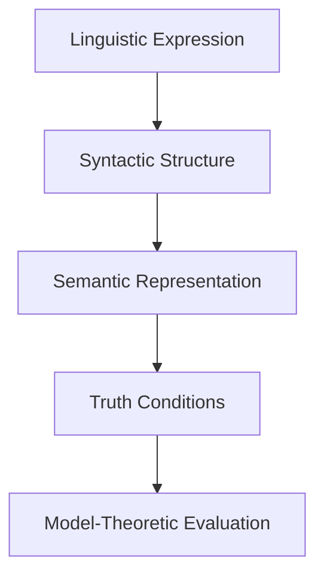
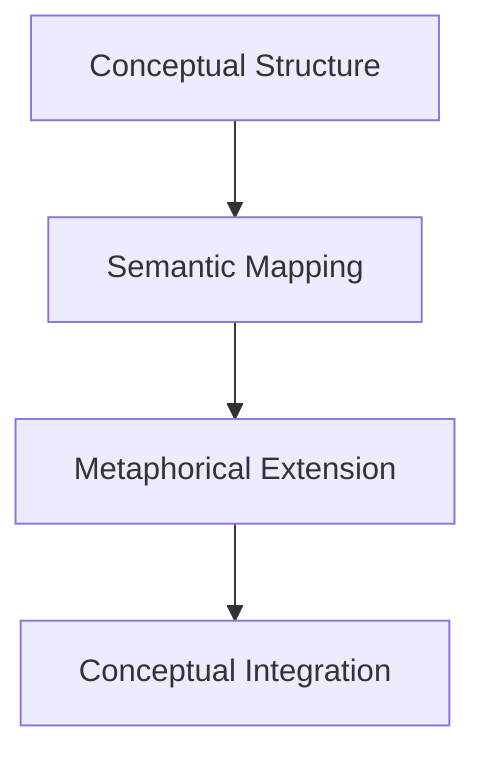
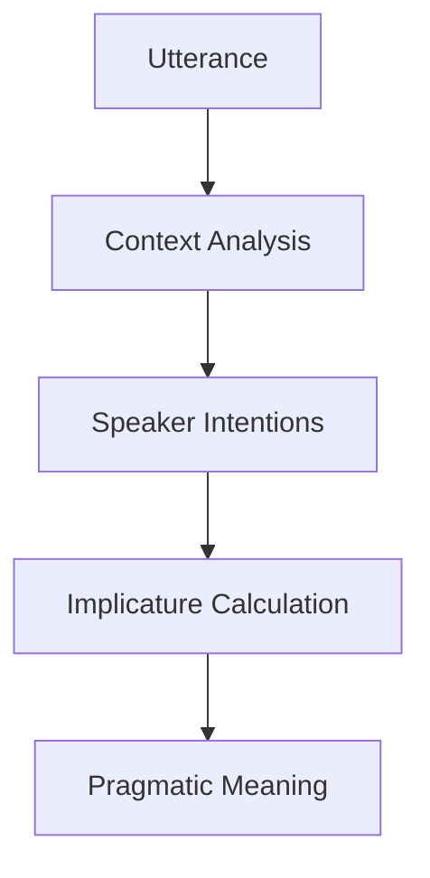
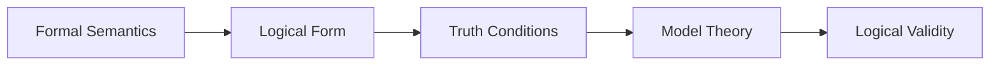
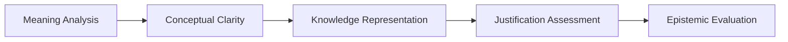
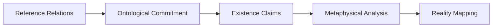
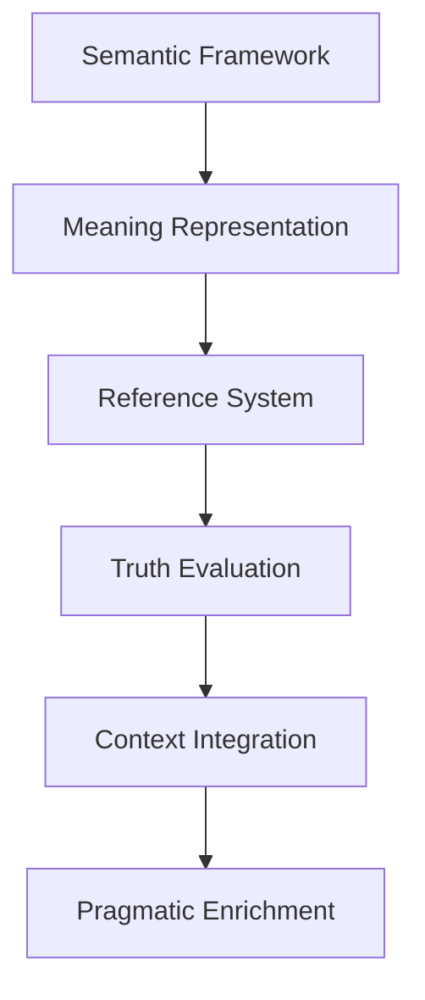

# 1. Semantics (DEF_FOR_SEMANTICS) **[PRIO: HIGH]**

*   **Semantics:** The study of meaning in language, examining how words, phrases, and symbols convey meaning, reference, and truth conditions within linguistic and logical systems.
*   **Description:** Semantics investigates the relationship between linguistic expressions and their meanings, exploring how meaning is constructed, interpreted, and evaluated. It addresses questions about reference, truth conditions, meaning relations, and the systematic nature of meaning across different contexts and languages.
*   **Formal Definition:** ∀s∃l∃m (Semantics(s) ↔ ∃l∃m (Language(l) ∧ Meaning(m) ∧ RelatesTo(s,l,m)))
*   **Type Classification:** LOGICAL / LINGUISTIC
*   **Priority Level:** HIGH
*   **Scientific Acceptance:** High (Established field in linguistics, philosophy, and logic with extensive theoretical development).
*   **Reference:** [Semantics (Linguistics)](https://en.wikipedia.org/wiki/Semantics), [Philosophy of Language](https://en.wikipedia.org/wiki/Philosophy_of_language), [Formal Semantics](https://en.wikipedia.org/wiki/Formal_semantics_(logic))
*   **Key Theories:** Truth-Conditional Semantics, Model-Theoretic Semantics, Pragmatic Semantics, Cognitive Semantics
*   **Context:** Semantics provides the foundation for understanding how language represents reality, enabling meaningful communication and logical analysis of linguistic expressions.

**[Called:]** "Meaning Theory" or "Semantic Analysis" or "Language Meaning"
- Meaning interpretation systems
- Reference and truth conditions
- Linguistic expression analysis
- Symbolic meaning relationships
- Contextual meaning evaluation

## Semantic Components

### **Lexical Semantics**
- **Word Meaning:** Individual word meanings and semantic properties
- **Semantic Fields:** Related word meanings and conceptual domains
- **Polysemy:** Multiple meanings of single words
- **Homonymy:** Different words with similar forms

### **Compositional Semantics**
- **Phrase Meaning:** How word meanings combine to form phrase meanings
- **Sentence Meaning:** Systematic construction of sentence-level meaning
- **Semantic Composition:** Rules for combining semantic elements
- **Type Theory:** Semantic types and their combinations

### **Truth-Conditional Semantics**
- **Truth Conditions:** Conditions under which statements are true
- **Model Theory:** Mathematical models of meaning and truth
- **Logical Form:** Underlying logical structure of sentences
- **Reference Relations:** How expressions refer to objects and concepts

### **Pragmatic Semantics**
- **Context Dependence:** Meaning variation based on context
- **Speaker Meaning:** Intended meaning beyond literal meaning
- **Implicature:** Implied meaning not explicitly stated
- **Speech Acts:** Meaning in terms of actions performed

## Semantic Theories

### **Formal Semantics**
- **Montague Grammar:** Mathematical treatment of natural language semantics
- **Possible Worlds Semantics:** Meaning in terms of possible scenarios
- **Type-Logical Semantics:** Semantic types and logical operations
- **Dynamic Semantics:** Meaning as information change

### **Cognitive Semantics**
- **Conceptual Metaphor:** Meaning through metaphorical mappings
- **Frame Semantics:** Meaning within conceptual frameworks
- **Prototype Theory:** Meaning based on typical examples
- **Embodied Semantics:** Meaning grounded in bodily experience

### **Philosophical Semantics**
- **Referential Theories:** Meaning as reference to objects
- **Ideational Theories:** Meaning as mental concepts
- **Use Theories:** Meaning as use in language games
- **Verification Theories:** Meaning as method of verification

## Semantic Relations

### **Synonymy and Antonymy**
- **Synonymy:** Words with similar meanings
- **Antonymy:** Words with opposite meanings
- **Hyponymy/Hypernymy:** Hierarchical meaning relationships
- **Meronymy/Holonymy:** Part-whole meaning relationships

### **Semantic Fields**
- **Lexical Fields:** Groups of related words
- **Semantic Networks:** Network structures of meaning relations
- **Conceptual Domains:** Areas of conceptual organization
- **Thematic Roles:** Semantic roles in event descriptions

### **Semantic Change**
- **Diachronic Semantics:** Historical meaning change
- **Semantic Shift:** Evolution of word meanings
- **Metaphorical Extension:** New meanings through metaphor
- **Semantic Bleaching:** Loss of semantic content

## Semantic Analysis Methods

### **Formal Analysis**

### **Cognitive Analysis**

### **Pragmatic Analysis**

## Semantic Integration

### **Semantics + Logic**

### **Semantics + Epistemology**

### **Semantics + Ontology**

## Semantic Applications

### **Natural Language Processing**
- **Semantic Parsing:** Extracting meaning from text
- **Word Sense Disambiguation:** Determining appropriate word meanings
- **Semantic Role Labeling:** Identifying semantic roles in sentences
- **Knowledge Representation:** Encoding meaning in computational systems

### **Philosophical Analysis**
- **Conceptual Analysis:** Clarifying philosophical concepts
- **Argument Analysis:** Evaluating semantic content of arguments
- **Theory Evaluation:** Assessing semantic coherence of theories
- **Language Critique:** Analyzing semantic precision and clarity

### **Cognitive Science**
- **Conceptual Structure:** Understanding mental representations
- **Language Acquisition:** How semantic knowledge develops
- **Conceptual Change:** How meanings evolve in learning
- **Cross-Linguistic Semantics:** Universal vs. language-specific meaning

## Semantic Challenges

### **Reference Problems**
- **Problem:** How words refer to objects and concepts
- **Challenge:** Direct vs. mediated reference, empty names
- **Approach:** Causal theories, descriptive theories, hybrid approaches
- **Resolution:** Context-sensitive reference determination

### **Truth Conditions**
- **Problem:** Specifying conditions for statement truth
- **Challenge:** Complex sentences, modal statements, indexicals
- **Approach:** Model-theoretic semantics, possible worlds
- **Resolution:** Compositional truth definitions

### **Context Dependence**
- **Problem:** Meaning variation across contexts
- **Challenge:** Indexicality, ambiguity, speaker intentions
- **Approach:** Pragmatic enrichment, context modeling
- **Resolution:** Dynamic semantic frameworks

## Semantic Framework Integration

### **Semantic Framework Design**

### **Semantic Quality Standards**
- **Clarity:** Semantic definitions must be precise and unambiguous
- **Consistency:** Semantic relations must be logically coherent
- **Completeness:** Semantic coverage must be comprehensive
- **Flexibility:** Semantic systems must handle context variation
- **Verifiability:** Semantic claims must be testable

## Philosophical Integration

### **Western Semantic Traditions**
- **Fregean Semantics:** Sense and reference distinction
- **Russell's Theory:** Definite descriptions and logical analysis
- **Wittgenstein:** Meaning as use and language games
- **Kripke:** Rigid designation and modal semantics

### **Eastern Semantic Traditions**
- **Buddhist Logic:** Semantic analysis of emptiness and dependent origination
- **Taoist Semantics:** Paradoxical language and ineffable meaning
- **Confucian Semantics:** Ritual language and social meaning
- **Indian Logic:** Nyaya semantics and inference systems

## Semantic Technology Integration

### **Computational Semantics**
- **Semantic Web:** Machine-readable meaning representation
- **Knowledge Graphs:** Semantic networks for information organization
- **Semantic Search:** Meaning-based information retrieval
- **Natural Language Understanding:** AI systems comprehending meaning

### **Semantic Standards**
- **RDF (Resource Description Framework):** Semantic data representation
- **OWL (Web Ontology Language):** Ontological semantics specification
- **Schema.org:** Structured data semantics for web content
- **JSON-LD:** Linked data semantics in JSON format

## Semantic Future Directions

### **Emerging Semantic Fields**
- **Computational Semantics:** AI-driven meaning analysis
- **Neurosemantics:** Brain basis of semantic processing
- **Quantum Semantics:** Meaning in quantum information contexts
- **Ecosemantics:** Environmental and ecological meaning systems

### **Semantic Integration Challenges**
- **Multimodal Semantics:** Integrating text, image, and sound meaning
- **Cross-Cultural Semantics:** Universal vs. culture-specific meaning
- **Dynamic Semantics:** Real-time meaning construction
- **Ethical Semantics:** Moral implications of semantic choices

## Conclusion

Semantics provides the essential framework for understanding how language represents meaning, enabling meaningful communication, logical analysis, and knowledge representation. From formal truth conditions to pragmatic context sensitivity, semantics bridges the gap between linguistic expressions and their cognitive, social, and ontological significance.

**Semantics is the systematic study of meaning in language, examining how expressions relate to concepts, reference, and truth conditions within linguistic and logical systems.**

## Confidence Assessment

**Term Definition Confidence:** 0.96 (Very High)
- **Rationale:** Semantics is a well-established field with extensive theoretical development
- **Validation:** Supported by linguistics, philosophy, logic, and cognitive science
- **Contextual Stability:** Fundamental to language understanding across disciplines
- **Practical Application:** Essential for communication, computation, and knowledge representation

## Related Terms

**Reference Terms:**
- [[logic.md]](logic.md) - Logic provides formal semantic frameworks
- [[language.md]](language.md) - Language is the primary domain of semantics
- [[meaning.md]](meaning.md) - Meaning is the central concern of semantics

**Prerequisite Terms:**
- [[reference.md]](reference.md) - Reference relations are key semantic components
- [[truth.md]](truth.md) - Truth conditions are central to formal semantics
- [[context.md]](context.md) - Context sensitivity is crucial for semantic analysis

**Related Terms:**
- [[syntax.md]](syntax.md) - Syntax and semantics form complementary language aspects
- [[pragmatics.md]](pragmatics.md) - Pragmatics extends semantics with context
- [[semiotics.md]](semiotics.md) - Semiotics provides broader sign and meaning theory

**Dependent Terms:**
- [[communication.md]](communication.md) - Communication relies on semantic understanding
- [[knowledge.md]](knowledge.md) - Knowledge representation requires semantic precision
- [[understanding.md]](understanding.md) - Understanding involves semantic processing

**See Also:**
- [[philosophy_of_language.md]](philosophy_of_language.md) - Philosophical analysis of language and meaning
- [[linguistics.md]](linguistics.md) - Scientific study of language including semantics
- [[cognitive_science.md]](cognitive_science.md) - Interdisciplinary study of mind including semantic processing