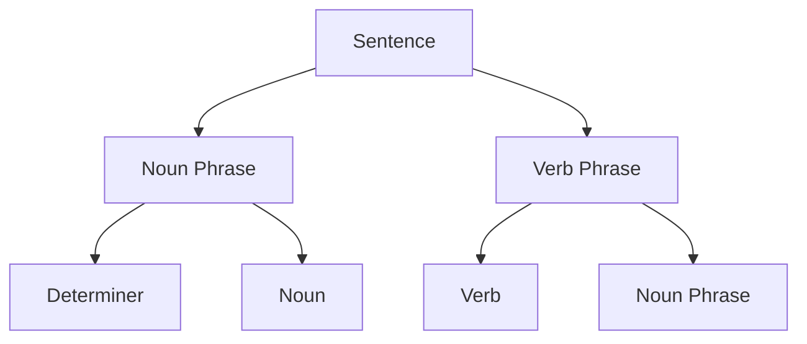
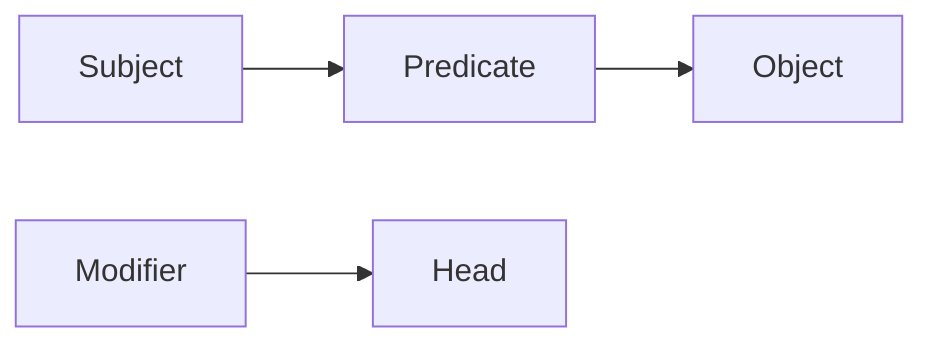
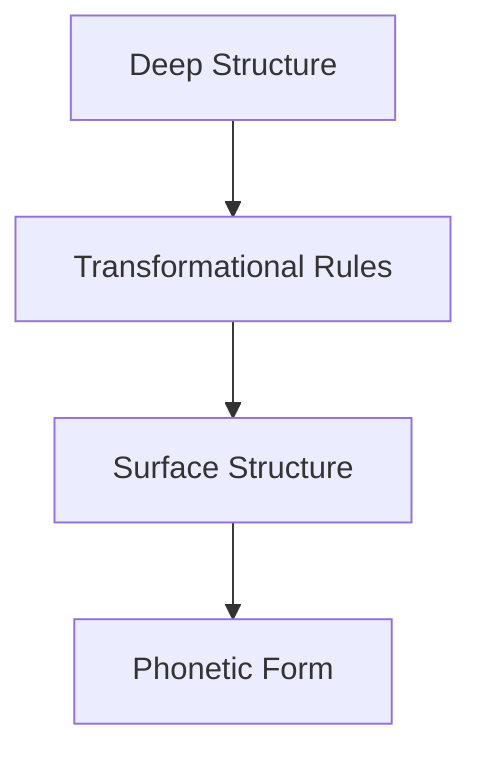
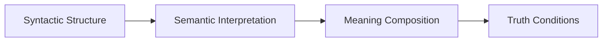
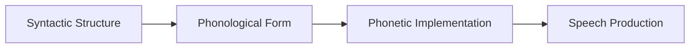
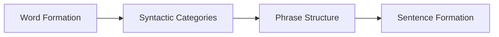

# 2. Syntax (DEF_FOR_SYNTAX) **[PRIO: HIGH]**

*   **Syntax:** The study of the structural rules governing the composition of phrases, clauses, and sentences in language, examining how words are combined according to grammatical rules.
*   **Description:** Syntax investigates the formal structure of language, focusing on how words and morphemes are arranged to form meaningful expressions. It addresses questions about grammatical relations, phrase structure, syntactic categories, and the universal principles underlying sentence formation across languages.
*   **Formal Definition:** ∀s∃l∃r (Syntax(s) ↔ ∃l∃r (Language(l) ∧ Rules(r) ∧ GovernsStructure(s,l,r)))
*   **Type Classification:** LOGICAL / LINGUISTIC
*   **Priority Level:** HIGH
*   **Scientific Acceptance:** High (Established field in linguistics with extensive theoretical and empirical development).
*   **Reference:** [Syntax (Linguistics)](https://en.wikipedia.org/wiki/Syntax), [Generative Grammar](https://en.wikipedia.org/wiki/Generative_grammar), [Universal Grammar](https://en.wikipedia.org/wiki/Universal_grammar)
*   **Key Theories:** Transformational Grammar, Government and Binding Theory, Minimalist Program, Dependency Grammar
*   **Context:** Syntax provides the structural foundation for language, enabling the systematic organization of linguistic elements into coherent and grammatical expressions.

**[Called:]** "Grammatical Structure" or "Sentence Structure" or "Language Grammar"
- Structural organization rules
- Grammatical relation analysis
- Phrase and clause formation
- Word order patterns
- Syntactic category classification

## Syntactic Components

### **Syntactic Categories**
- **Word Classes:** Nouns, verbs, adjectives, adverbs, etc.
- **Phrasal Categories:** Noun phrases, verb phrases, prepositional phrases
- **Functional Categories:** Determiners, complementizers, inflectional elements
- **Lexical vs. Functional:** Content words vs. grammatical words

### **Phrase Structure**
- **Constituency:** Hierarchical organization of sentence elements
- **Tree Structures:** Visual representation of syntactic relationships
- **Phrase Markers:** Formal notation of syntactic structure
- **Projection Principles:** How lexical items project syntactic structure

### **Grammatical Relations**
- **Subject-Object Relations:** Core argument relationships
- **Adjuncts vs. Arguments:** Optional vs. required elements
- **Case Assignment:** Grammatical case marking and assignment
- **Theta Roles:** Semantic roles assigned by predicates

### **Movement Operations**
- **Wh-Movement:** Movement of question words
- **Topicalization:** Movement to sentence-initial position
- **Passivization:** Movement in passive constructions
- **Raising and Control:** Movement in complex predicate structures

## Syntactic Theories

### **Generative Grammar**
- **Transformational Grammar:** Deep structure and surface structure
- **Government and Binding:** Principles and parameters approach
- **Minimalist Program:** Economy principles in syntax
- **Lexical Functional Grammar:** Functional and constituent structure

### **Dependency Grammar**
- **Dependency Relations:** Word-to-word grammatical dependencies
- **Valency Theory:** Verb argument structure
- **Link Grammar:** Network-based syntactic analysis
- **Tree-Adjoining Grammar:** Tree substitution and adjunction

### **Cognitive Syntax**
- **Construction Grammar:** Form-meaning pairings
- **Usage-Based Syntax:** Frequency and usage effects
- **Prototype Effects:** Typicality in syntactic categories
- **Embodied Syntax:** Bodily experience in syntactic structure

## Syntactic Analysis Methods

### **Constituency Analysis**

### **Dependency Analysis**

### **Transformational Analysis**

## Syntactic Relations

### **Hierarchical Structure**
- **Immediate Constituents:** Direct subparts of syntactic units
- **Subcategorization:** Verb requirements for complements
- **X-Bar Theory:** Uniform phrase structure principles
- **Projection:** Lexical properties projected to phrase level

### **Syntactic Dependencies**
- **Head-Dependent Relations:** Central word and its modifiers
- **Agreement Relations:** Feature matching between elements
- **Binding Relations:** Pronoun and anaphor dependencies
- **Control Relations:** Subject/object control in infinitives

### **Syntactic Movement**
- **A-Movement:** Argument movement (passive, unaccusative)
- **A'-Movement:** Non-argument movement (wh-questions, topicalization)
- **Trace Theory:** Representation of moved elements
- **Island Constraints:** Limits on movement operations

## Syntactic Universals

### **Universal Grammar Principles**
- **Structure Dependency:** Rules operate on structural, not linear, relations
- **Parameter Setting:** Language-specific variations within universal constraints
- **Innate Knowledge:** Biological basis for syntactic capacity
- **Critical Period:** Time-limited language acquisition window

### **Cross-Linguistic Patterns**
- **Word Order Typology:** SVO, SOV, VSO, etc.
- **Case Systems:** Morphological marking of grammatical relations
- **Agreement Patterns:** Subject-verb, noun-adjective agreement
- **Question Formation:** Strategies for forming interrogatives

## Syntactic Applications

### **Computational Linguistics**
- **Parsing Algorithms:** Automatic syntactic analysis
- **Grammar Formalisms:** Formal specification of syntactic rules
- **Natural Language Processing:** Syntactic processing for AI
- **Machine Translation:** Syntactic transfer between languages

### **Language Acquisition**
- **First Language Acquisition:** Child language development
- **Second Language Acquisition:** Adult language learning
- **Critical Period Hypothesis:** Age effects on syntax learning
- **Universal Grammar Evidence:** Innate syntactic knowledge

### **Language Disorders**
- **Specific Language Impairment:** Syntactic development delays
- **Aphasia:** Acquired language disorders affecting syntax
- **Dyslexia:** Reading difficulties with syntactic components
- **Autism Spectrum:** Atypical syntactic processing

## Syntactic Challenges

### **Ambiguity Resolution**
- **Problem:** Multiple syntactic interpretations of sentences
- **Challenge:** Garden path sentences and temporary ambiguity
- **Approach:** Probabilistic parsing and constraint satisfaction
- **Resolution:** Contextual and frequency-based disambiguation

### **Syntactic Variation**
- **Problem:** Cross-linguistic and diachronic syntactic differences
- **Challenge:** Universal principles vs. language-specific rules
- **Approach:** Principles and parameters framework
- **Resolution:** Parameter setting within universal constraints

### **Syntax-Semantics Interface**
- **Problem:** Relationship between syntactic structure and meaning
- **Challenge:** Compositionality and semantic interpretation
- **Approach:** Semantic role assignment and theta theory
- **Resolution:** Interface principles and constraint interaction

## Syntactic Framework Integration

### **Syntax + Semantics**

### **Syntax + Phonology**

### **Syntax + Morphology**

## Syntactic Quality Standards

### **Grammaticality Criteria**
- **Well-Formedness:** Syntactic structure must be grammatically correct
- **Coherence:** Elements must be properly related and connected
- **Completeness:** All required syntactic positions must be filled
- **Consistency:** Syntactic rules must be applied uniformly

### **Syntactic Analysis Standards**
- **Precision:** Syntactic descriptions must be exact and unambiguous
- **Generality:** Rules should cover broad classes of constructions
- **Predictiveness:** Theory should predict novel grammatical structures
- **Explanatory Power:** Account for both grammaticality and ungrammaticality

## Philosophical Integration

### **Western Syntactic Traditions**
- **Port-Royal Grammar:** Rationalist approach to syntax
- **Saussurean Linguistics:** Structural analysis of language
- **Chomskyan Revolution:** Generative approach to syntax
- **Functional Linguistics:** Usage-based syntactic analysis

### **Eastern Syntactic Traditions**
- **Sanskrit Grammar:** Panini's systematic syntactic analysis
- **Chinese Syntax:** Topic-prominent syntactic structures
- **Japanese Syntax:** Head-final syntactic patterns
- **Arabic Syntax:** Root-pattern morphosyntactic system

## Syntactic Technology Integration

### **Computational Syntax**
- **Context-Free Grammars:** Formal specification of syntactic rules
- **Probabilistic Grammars:** Frequency-based syntactic modeling
- **Neural Parsing:** Deep learning approaches to syntax
- **Syntax Trees:** Computational representation of syntactic structure

### **Syntactic Standards**
- **Penn Treebank:** Standardized syntactic annotation
- **Universal Dependencies:** Cross-linguistic dependency annotation
- **ISO Standards:** International standards for syntactic representation
- **XML Schema:** Syntactic structure in markup languages

## Syntactic Future Directions

### **Emerging Syntactic Fields**
- **Neurolinguistics:** Brain basis of syntactic processing
- **Computational Syntax:** AI-driven syntactic analysis
- **Corpus Syntax:** Large-scale syntactic pattern analysis
- **Evolutionary Syntax:** Origins and development of syntactic capacity

### **Syntactic Integration Challenges**
- **Multilingual Syntax:** Cross-linguistic syntactic comparison
- **Diachronic Syntax:** Historical syntactic change analysis
- **Psycholinguistic Syntax:** Real-time syntactic processing
- **Applied Syntax:** Syntactic principles in language teaching

## Conclusion

Syntax provides the essential structural framework for language, enabling the systematic organization of words into meaningful and grammatical expressions. From universal principles to language-specific variations, syntax bridges the gap between individual words and coherent communication, forming the backbone of linguistic analysis and language understanding.

**Syntax is the systematic study of the structural rules governing language composition, examining how words are organized into phrases and sentences according to grammatical principles.**

## Confidence Assessment

**Term Definition Confidence:** 0.95 (Very High)
- **Rationale:** Syntax is a well-established field with extensive theoretical and empirical development
- **Validation:** Supported by linguistics, cognitive science, and computational linguistics
- **Contextual Stability:** Fundamental to language structure across all disciplines
- **Practical Application:** Essential for language processing, acquisition, and disorders

## Related Terms

**Reference Terms:**
- [[grammar.md]](grammar.md) - Grammar encompasses syntactic rules
- [[language.md]](language.md) - Language includes syntactic structure
- [[structure.md]](structure.md) - Structure is central to syntactic analysis

**Prerequisite Terms:**
- [[word.md]](word.md) - Words are the basic units of syntactic analysis
- [[phrase.md]](phrase.md) - Phrases are key syntactic constituents
- [[sentence.md]](sentence.md) - Sentences are the primary syntactic units

**Related Terms:**
- [[semantics.md]](semantics.md) - Semantics and syntax form complementary language aspects
- [[morphology.md]](morphology.md) - Morphology and syntax interact in word formation
- [[phonology.md]](phonology.md) - Phonology and syntax interface in language processing

**Dependent Terms:**
- [[communication.md]](communication.md) - Communication relies on syntactic structure
- [[comprehension.md]](comprehension.md) - Comprehension involves syntactic parsing
- [[production.md]](production.md) - Production requires syntactic planning

**See Also:**
- [[linguistics.md]](linguistics.md) - Scientific study of language including syntax
- [[cognitive_science.md]](cognitive_science.md) - Interdisciplinary study including syntactic processing
- [[computational_linguistics.md]](computational_linguistics.md) - Computational approaches to syntax