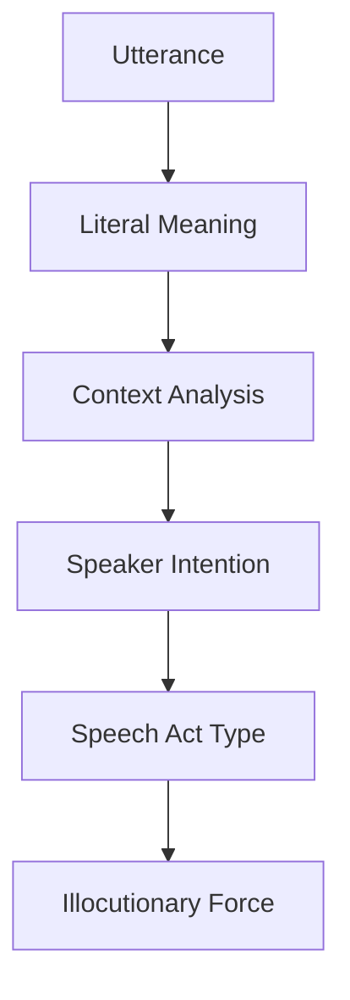
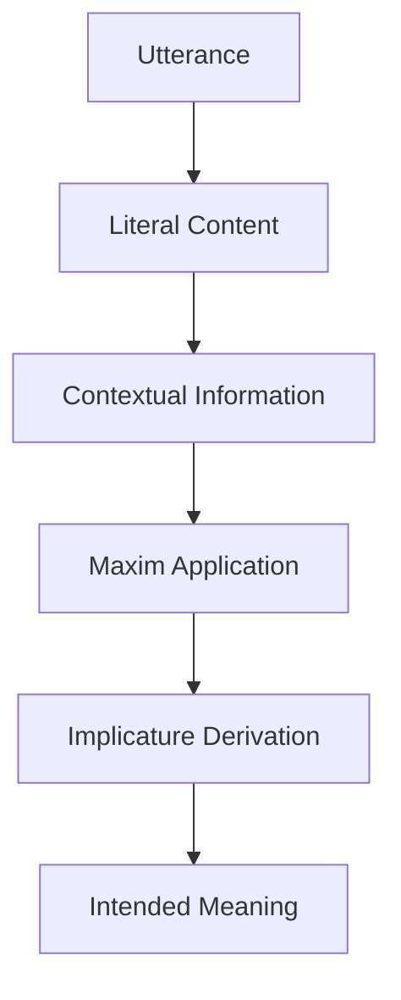
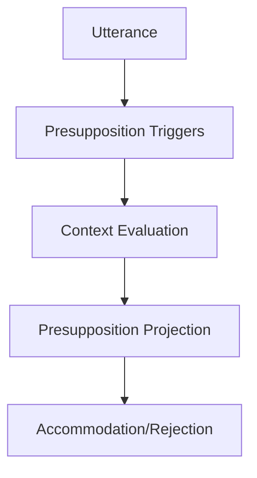
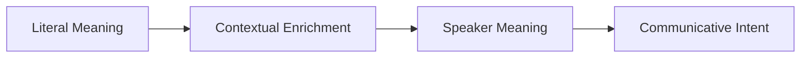
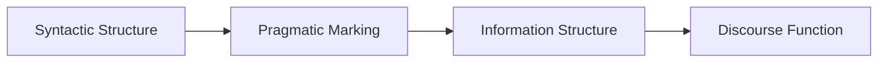
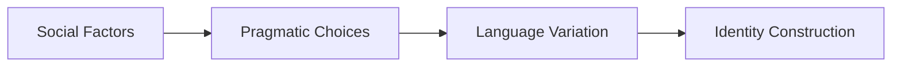

# 3. Pragmatics (DEF_FOR_PRAGMATICS) **[PRIO: HIGH]**

*   **Pragmatics:** The study of how context contributes to meaning in language use, examining how speakers convey meaning beyond literal interpretation through context, intention, and social factors.
*   **Description:** Pragmatics investigates the aspects of meaning that cannot be captured by semantic theory alone, focusing on how language is used in social contexts. It addresses questions about speaker intentions, conversational implicature, speech acts, presupposition, and the role of context in interpretation.
*   **Formal Definition:** ∀p∃l∃c∃s (Pragmatics(p) ↔ ∃l∃c∃s (Language(l) ∧ Context(c) ∧ Speaker(s) ∧ ContextualMeaning(p,l,c,s)))
*   **Type Classification:** LOGICAL / LINGUISTIC
*   **Priority Level:** HIGH
*   **Scientific Acceptance:** High (Established field in linguistics and philosophy with extensive theoretical development).
*   **Reference:** [Pragmatics (Linguistics)](https://en.wikipedia.org/wiki/Pragmatics), [Speech Act Theory](https://en.wikipedia.org/wiki/Speech_act), [Conversational Implicature](https://en.wikipedia.org/wiki/Implicature)
*   **Key Theories:** Speech Act Theory, Conversational Implicature, Relevance Theory, Politeness Theory
*   **Context:** Pragmatics provides the bridge between literal meaning and intended meaning, enabling effective communication through contextual understanding and social awareness.

**[Called:]** "Contextual Meaning" or "Language Use" or "Communicative Intent"
- Context-dependent interpretation
- Speaker intention analysis
- Social language use
- Conversational principles
- Pragmatic inference

## Pragmatic Components

### **Speech Acts**
- **Locutionary Acts:** The act of saying something with literal meaning
- **Illocutionary Acts:** The act performed in saying something (promising, requesting, etc.)
- **Perlocutionary Acts:** The effects of saying something on the listener
- **Illocutionary Force:** The function or purpose of an utterance

### **Conversational Implicature**
- **Conversational Maxims:** Quality, Quantity, Relation, Manner (Gricean maxims)
- **Implicature Types:** Conversational, conventional, generalized, particularized
- **Flouting Maxims:** Deliberate violation for conversational effect
- **Implicature Calculation:** Inferring intended meaning beyond literal content

### **Presupposition**
- **Presupposition Triggers:** Linguistic elements that trigger presuppositions
- **Presupposition Projection:** How presuppositions survive in complex sentences
- **Presupposition Accommodation:** Adjusting context to accept presuppositions
- **Presupposition Failure:** When presuppositions are not satisfied

### **Deixis**
- **Person Deixis:** Pronouns and person reference (I, you, we, they)
- **Spatial Deixis:** Location reference (here, there, this, that)
- **Temporal Deixis:** Time reference (now, then, yesterday, tomorrow)
- **Social Deixis:** Social relationship markers (honorifics, titles)

## Pragmatic Theories

### **Speech Act Theory**
- **Austin's Classification:** Locutionary, illocutionary, perlocutionary acts
- **Searle's Taxonomy:** Assertives, directives, commissives, expressives, declarations
- **Illocutionary Force Indicators:** Linguistic markers of speech act type
- **Felicity Conditions:** Conditions for successful speech acts

### **Conversational Implicature**
- **Gricean Maxims:** Cooperative principle and conversational maxims
- **Implicature Derivation:** Calculating intended meaning from context
- **Scalar Implicature:** Implicatures from scale of alternatives
- **Metaphor and Irony:** Figurative language as pragmatic phenomena

### **Relevance Theory**
- **Cognitive Principle:** Human cognition tends to maximize relevance
- **Communicative Principle:** Every utterance conveys presumption of optimal relevance
- **Contextual Effects:** Cognitive effects achieved by processing utterances
- **Processing Effort:** Cognitive effort required to process utterances

### **Politeness Theory**
- **Positive Politeness:** Attending to hearer's positive face (desire for approval)
- **Negative Politeness:** Attending to hearer's negative face (desire for freedom)
- **Face-Threatening Acts:** Actions that damage hearer's face
- **Politeness Strategies:** Ways to mitigate face-threatening acts

## Pragmatic Analysis Methods

### **Speech Act Analysis**

### **Implicature Analysis**

### **Presupposition Analysis**

## Pragmatic Relations

### **Context and Meaning**
- **Situational Context:** Physical and social circumstances of utterance
- **Linguistic Context:** Preceding and following discourse
- **Cultural Context:** Shared cultural knowledge and norms
- **Psychological Context:** Mental states and intentions of participants

### **Speaker and Hearer**
- **Common Ground:** Shared knowledge between participants
- **Mutual Knowledge:** Knowledge that participants know they share
- **Speaker Meaning:** Intended meaning of the speaker
- **Hearer Interpretation:** Understanding achieved by the hearer

### **Language and Society**
- **Register Variation:** Language variation by social context
- **Dialect Variation:** Language variation by geographical/social group
- **Code Switching:** Alternating between language varieties
- **Language Change:** Pragmatic factors in language evolution

## Pragmatic Applications

### **Discourse Analysis**
- **Conversation Analysis:** Structure and organization of conversation
- **Narrative Analysis:** Pragmatic aspects of storytelling
- **Genre Analysis:** Pragmatic conventions of text types
- **Critical Discourse Analysis:** Power relations in language use

### **Language Teaching**
- **Pragmatic Competence:** Teaching appropriate language use
- **Cross-Cultural Communication:** Avoiding pragmatic failures
- **Politeness Strategies:** Teaching social appropriateness
- **Speech Act Performance:** Teaching functional language use

### **Computational Pragmatics**
- **Natural Language Understanding:** Pragmatic interpretation in AI
- **Dialogue Systems:** Pragmatic modeling in conversational agents
- **Sentiment Analysis:** Pragmatic aspects of opinion mining
- **Machine Translation:** Pragmatic equivalence in translation

## Pragmatic Challenges

### **Context Sensitivity**
- **Problem:** Meaning varies extensively with context
- **Challenge:** Specifying relevant contextual factors
- **Approach:** Contextual parameters and relevance assessment
- **Resolution:** Dynamic context modeling and inference

### **Speaker Intention**
- **Problem:** Inferring speaker's intended meaning
- **Challenge:** Distinguishing literal from intended meaning
- **Approach:** Intentional stance and pragmatic inference
- **Resolution:** Theory of mind and contextual reasoning

### **Cultural Variation**
- **Problem:** Pragmatic norms vary across cultures
- **Challenge:** Universal vs. culture-specific pragmatic principles
- **Approach:** Cross-cultural pragmatic analysis
- **Resolution:** Cultural schema theory and pragmatic transfer

## Pragmatic Framework Integration

### **Pragmatics + Semantics**

### **Pragmatics + Syntax**

### **Pragmatics + Social Context**

## Pragmatic Quality Standards

### **Communicative Effectiveness**
- **Clarity:** Pragmatic choices must facilitate understanding
- **Appropriateness:** Language use must fit the social context
- **Efficiency:** Communication should achieve goals with minimal effort
- **Politeness:** Language use should maintain social harmony

### **Pragmatic Analysis Standards**
- **Context Sensitivity:** Analysis must consider relevant contextual factors
- **Intentionality:** Analysis must account for speaker intentions
- **Conventionality:** Analysis must recognize conventional pragmatic patterns
- **Flexibility:** Analysis must handle novel pragmatic phenomena

## Philosophical Integration

### **Western Pragmatic Traditions**
- **Pragmatism:** Philosophy of practical consequences and applications
- **Ordinary Language Philosophy:** Analysis of everyday language use
- **Speech Act Philosophy:** Philosophical analysis of language as action
- **Relevance Theory:** Cognitive approach to communication

### **Eastern Pragmatic Traditions**
- **Confucian Pragmatics:** Language use in maintaining social harmony
- **Buddhist Pragmatics:** Language as skillful means for enlightenment
- **Taoist Pragmatics:** Language use in expressing ineffable truths
- **Hindu Pragmatics:** Language in ritual and spiritual contexts

## Pragmatic Technology Integration

### **Computational Pragmatics**
- **Dialogue Management:** Pragmatic control of conversation flow
- **Intent Recognition:** Identifying speaker intentions from utterances
- **Context Modeling:** Representing and updating conversational context
- **Pragmatic Enrichment:** Adding contextual meaning to literal content

### **Pragmatic Standards**
- **ISO Standards:** International standards for pragmatic annotation
- **Discourse Representation:** Formal representation of pragmatic content
- **Speech Act Annotation:** Standardized marking of speech acts
- **Politeness Marking:** Annotation of politeness strategies

## Pragmatic Future Directions

### **Emerging Pragmatic Fields**
- **Corpus Pragmatics:** Large-scale analysis of pragmatic phenomena
- **Neuropragmatics:** Brain basis of pragmatic processing
- **Evolutionary Pragmatics:** Origins of pragmatic abilities
- **Digital Pragmatics:** Pragmatic aspects of digital communication

### **Pragmatic Integration Challenges**
- **Multimodal Pragmatics:** Integrating verbal and non-verbal cues
- **Cross-Cultural Pragmatics:** Universal vs. culture-specific principles
- **Developmental Pragmatics:** Acquisition of pragmatic competence
- **Clinical Pragmatics:** Pragmatic disorders and interventions

## Conclusion

Pragmatics provides the essential framework for understanding how language functions in real-world communication, bridging the gap between literal meaning and intended meaning. From conversational principles to social context sensitivity, pragmatics enables effective and appropriate language use across diverse communicative situations.

**Pragmatics is the systematic study of how context contributes to meaning in language use, examining how speakers convey intended meaning through contextual factors, social awareness, and communicative intentions.**

## Confidence Assessment

**Term Definition Confidence:** 0.94 (Very High)
- **Rationale:** Pragmatics is a well-established field with extensive theoretical and empirical development
- **Validation:** Supported by linguistics, philosophy, cognitive science, and communication studies
- **Contextual Stability:** Fundamental to understanding real-world language use
- **Practical Application:** Essential for effective communication, language teaching, and AI

## Related Terms

**Reference Terms:**
- [[communication.md]](communication.md) - Communication relies on pragmatic principles
- [[context.md]](context.md) - Context is central to pragmatic analysis
- [[intention.md]](intention.md) - Speaker intention is key to pragmatic interpretation

**Prerequisite Terms:**
- [[semantics.md]](semantics.md) - Semantics provides the foundation for pragmatic enrichment
- [[syntax.md]](syntax.md) - Syntax and pragmatics interact in language processing
- [[meaning.md]](meaning.md) - Meaning includes both semantic and pragmatic components

**Related Terms:**
- [[speech_act.md]](speech_act.md) - Speech acts are central pragmatic phenomena
- [[implicature.md]](implicature.md) - Implicature is a key pragmatic concept
- [[politeness.md]](politeness.md) - Politeness is a major pragmatic concern

**Dependent Terms:**
- [[conversation.md]](conversation.md) - Conversation relies on pragmatic principles
- [[discourse.md]](discourse.md) - Discourse analysis incorporates pragmatic analysis
- [[understanding.md]](understanding.md) - Understanding involves pragmatic interpretation

**See Also:**
- [[philosophy_of_language.md]](philosophy_of_language.md) - Philosophical analysis of language including pragmatics
- [[linguistics.md]](linguistics.md) - Scientific study of language including pragmatics
- [[cognitive_science.md]](cognitive_science.md) - Interdisciplinary study including pragmatic processing