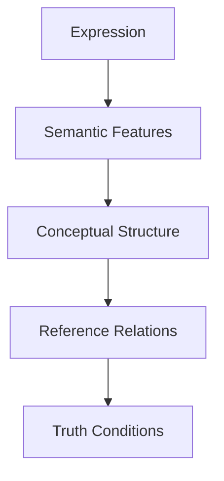
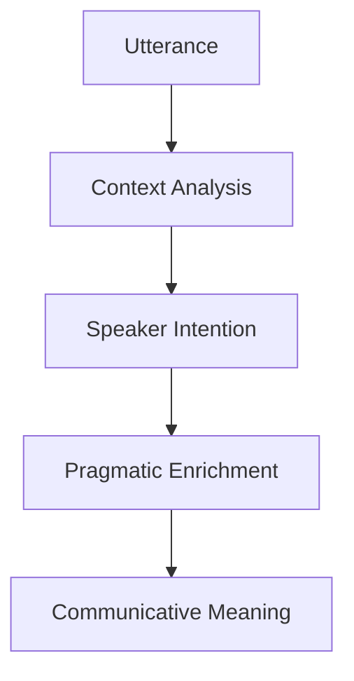
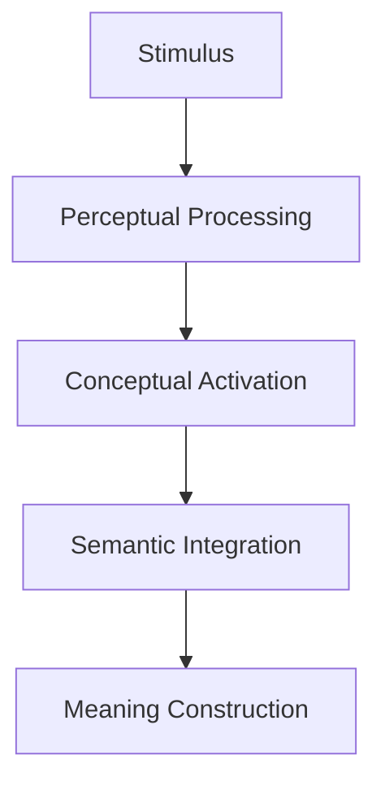
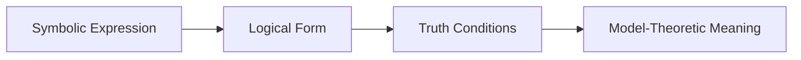
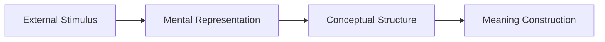
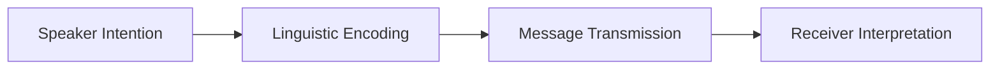

# 4. Meaning (DEF_FOR_MEANING) **[PRIO: HIGH]**

*   **Meaning:** The relationship between signs, symbols, or expressions and what they represent, refer to, or signify, encompassing semantic content, conceptual understanding, and communicative intent.
*   **Description:** Meaning investigates how linguistic expressions, mental representations, and symbolic systems connect to concepts, objects, and states of affairs. It addresses questions about reference, sense, interpretation, understanding, and the nature of representation in language, thought, and communication.
*   **Formal Definition:** ∀m∃s∃r (Meaning(m) ↔ ∃s∃r (Sign(s) ∧ Referent(r) ∧ Signifies(m,s,r)))
*   **Type Classification:** LOGICAL / LINGUISTIC
*   **Priority Level:** HIGH
*   **Scientific Acceptance:** High (Fundamental concept in philosophy, linguistics, cognitive science, and semiotics with extensive theoretical development).
*   **Reference:** [Meaning (Philosophy)](https://en.wikipedia.org/wiki/Meaning_(philosophy)), [Semiotics](https://en.wikipedia.org/wiki/Semiotics), [Philosophy of Language](https://en.wikipedia.org/wiki/Philosophy_of_language)
*   **Key Theories:** Referential Theory, Ideational Theory, Use Theory, Verification Theory, Inferential Role Semantics
*   **Context:** Meaning provides the foundation for understanding how symbols represent reality, enabling communication, thought, and knowledge representation across different domains and modalities.

**[Called:]** "Significance" or "Signification" or "Semantic Content"
- Symbol-referent relationships
- Conceptual representation
- Interpretive understanding
- Communicative content
- Cognitive significance

## Dimensions of Meaning

### **Semantic Meaning**
- **Lexical Meaning:** Word-level meaning and semantic properties
- **Compositional Meaning:** How word meanings combine to form larger meanings
- **Truth-Conditional Meaning:** Conditions under which expressions are true
- **Reference Relations:** How expressions refer to objects and concepts

### **Pragmatic Meaning**
- **Speaker Meaning:** Intended meaning of the speaker
- **Conversational Meaning:** Meaning derived from context and interaction
- **Implicature:** Implied meaning beyond literal content
- **Speech Acts:** Meaning as action and function

### **Cognitive Meaning**
- **Conceptual Structure:** Mental representations underlying meaning
- **Semantic Networks:** Network structures of conceptual relationships
- **Prototype Effects:** Typicality in conceptual categories
- **Embodied Meaning:** Bodily experience in meaning construction

### **Social Meaning**
- **Cultural Meaning:** Shared cultural interpretations and associations
- **Conventional Meaning:** Socially established meaning conventions
- **Indexical Meaning:** Context-dependent and speaker-relative meaning
- **Symbolic Meaning:** Meaning in cultural and symbolic systems

## Theories of Meaning

### **Referential Theories**
- **Direct Reference:** Meaning as direct connection to objects
- **Descriptive Reference:** Meaning as description of referents
- **Causal Reference:** Meaning through causal chains of reference
- **Cluster Descriptions:** Meaning as clusters of descriptive properties

### **Ideational Theories**
- **Mental Concepts:** Meaning as mental representations
- **Ideas and Images:** Meaning as associated mental images
- **Conceptual Roles:** Meaning as role in cognitive system
- **Internal Representations:** Meaning as internal symbolic structures

### **Use Theories**
- **Language Games:** Meaning as use in linguistic practices
- **Functional Roles:** Meaning as functional role in communication
- **Social Practices:** Meaning as participation in social activities
- **Contextual Use:** Meaning determined by contextual usage

### **Verification Theories**
- **Empirical Verification:** Meaning as method of verification
- **Operational Definitions:** Meaning as operational procedures
- **Testability:** Meaning as testable consequences
- **Falsifiability:** Meaning as potential for falsification

## Meaning Analysis Methods

### **Semantic Analysis**

### **Pragmatic Analysis**

### **Cognitive Analysis**

## Meaning Relations

### **Synonymy and Antonymy**
- **Synonymy:** Expressions with similar meanings
- **Antonymy:** Expressions with opposite meanings
- **Hyponymy/Hypernymy:** Hierarchical meaning relationships
- **Meronymy/Holonymy:** Part-whole meaning relationships

### **Entailment and Presupposition**
- **Entailment:** Logical consequence relationships between meanings
- **Presupposition:** Background assumptions required for meaning
- **Implication:** Logical and pragmatic meaning consequences
- **Contradiction:** Incompatible meaning relationships

### **Ambiguity and Vagueness**
- **Lexical Ambiguity:** Multiple meanings of single expressions
- **Structural Ambiguity:** Multiple interpretations of sentence structure
- **Semantic Vagueness:** Fuzzy boundaries of meaning
- **Contextual Disambiguation:** Resolving ambiguity through context

## Meaning in Different Domains

### **Natural Language Meaning**
- **Word Meaning:** Lexical semantics and vocabulary
- **Sentence Meaning:** Propositional content and truth conditions
- **Discourse Meaning:** Text-level meaning and coherence
- **Pragmatic Meaning:** Context-dependent interpretation

### **Logical Meaning**
- **Logical Constants:** Meaning of logical operators and quantifiers
- **Formal Semantics:** Precise meaning in formal systems
- **Model-Theoretic Meaning:** Meaning in terms of models and interpretations
- **Proof-Theoretic Meaning:** Meaning in terms of inference rules

### **Mathematical Meaning**
- **Mathematical Concepts:** Meaning of mathematical objects and operations
- **Formal Definitions:** Precise meaning specifications
- **Proof Meaning:** Meaning of mathematical proofs and derivations
- **Structural Meaning:** Meaning in terms of mathematical structures

### **Computational Meaning**
- **Programming Semantics:** Meaning of programming language constructs
- **Data Semantics:** Meaning of data structures and information
- **Algorithmic Meaning:** Meaning of computational processes
- **Interface Meaning:** Meaning in human-computer interaction

## Meaning Challenges

### **Reference Problems**
- **Problem:** How symbols refer to objects and concepts
- **Challenge:** Empty names, fictional entities, theoretical terms
- **Approach:** Causal theories, descriptive theories, hybrid approaches
- **Resolution:** Context-sensitive reference determination

### **Compositionality**
- **Problem:** How complex meanings are built from simpler parts
- **Challenge:** Idioms, metaphors, context-dependent meanings
- **Approach:** Compositional semantics, dynamic semantics
- **Resolution:** Flexible composition principles with context integration

### **Context Dependence**
- **Problem:** Meaning variation across contexts
- **Challenge:** Indexicals, demonstratives, speaker-relative meanings
- **Approach:** Contextual semantics, pragmatic enrichment
- **Resolution:** Dynamic context modeling and inference

## Meaning Framework Integration

### **Meaning + Logic**

### **Meaning + Cognition**

### **Meaning + Communication**

## Meaning Quality Standards

### **Semantic Precision**
- **Clarity:** Meaning must be clear and unambiguous
- **Consistency:** Meaning must be logically coherent
- **Completeness:** Meaning must cover relevant aspects
- **Precision:** Meaning must be specific and exact

### **Pragmatic Appropriateness**
- **Context Sensitivity:** Meaning must fit the communicative context
- **Intention Alignment:** Meaning must match speaker intentions
- **Audience Appropriateness:** Meaning must be suitable for the audience
- **Functional Effectiveness:** Meaning must achieve communicative goals

## Philosophical Integration

### **Western Meaning Traditions**
- **Platonic Theory:** Meaning as participation in eternal forms
- **Aristotelian Theory:** Meaning as essence and substance
- **Medieval Theories:** Meaning in terms of signification and supposition
- **Modern Theories:** Referential, ideational, and use theories

### **Eastern Meaning Traditions**
- **Buddhist Semantics:** Meaning as emptiness and dependent origination
- **Taoist Semantics:** Meaning as ineffable and paradoxical
- **Confucian Semantics:** Meaning as ritual and social harmony
- **Hindu Semantics:** Meaning as divine revelation and spiritual insight

## Meaning Technology Integration

### **Computational Semantics**
- **Semantic Web:** Machine-readable meaning representation
- **Knowledge Graphs:** Semantic networks for information organization
- **Natural Language Understanding:** AI systems comprehending meaning
- **Semantic Search:** Meaning-based information retrieval

### **Meaning Standards**
- **RDF (Resource Description Framework):** Semantic data representation
- **OWL (Web Ontology Language):** Ontological meaning specification
- **Schema.org:** Structured data meaning for web content
- **JSON-LD:** Linked data meaning in JSON format

## Meaning Future Directions

### **Emerging Meaning Fields**
- **Neurosemantics:** Brain basis of meaning processing
- **Computational Semantics:** AI-driven meaning analysis
- **Quantum Semantics:** Meaning in quantum information contexts
- **Ecosemantics:** Environmental and ecological meaning systems

### **Meaning Integration Challenges**
- **Multimodal Meaning:** Integrating text, image, and sound meaning
- **Cross-Cultural Meaning:** Universal vs. culture-specific meaning
- **Dynamic Meaning:** Real-time meaning construction
- **Ethical Meaning:** Moral implications of meaning choices

## Conclusion

Meaning provides the essential bridge between symbols and reality, enabling understanding, communication, and knowledge representation. From referential connections to conceptual structures, from semantic precision to pragmatic appropriateness, meaning encompasses the fundamental relationship between signs and what they represent across all domains of human experience.

**Meaning is the systematic relationship between signs, symbols, or expressions and what they represent, refer to, or signify, encompassing semantic content, conceptual understanding, and communicative intent.**

## Confidence Assessment

**Term Definition Confidence:** 0.97 (Very High)
- **Rationale:** Meaning is a fundamental concept with extensive theoretical development across multiple disciplines
- **Validation:** Supported by philosophy, linguistics, cognitive science, semiotics, and computer science
- **Contextual Stability:** Central to understanding representation and communication across all domains
- **Practical Application:** Essential for language, thought, AI, and knowledge representation

## Related Terms

**Reference Terms:**
- [[semantics.md]](semantics.md) - Semantics studies meaning systematically
- [[reference.md]](reference.md) - Reference is a key aspect of meaning
- [[sign.md]](sign.md) - Signs are vehicles of meaning

**Prerequisite Terms:**
- [[symbol.md]](symbol.md) - Symbols are fundamental to meaning
- [[concept.md]](concept.md) - Concepts are mental representations of meaning
- [[representation.md]](representation.md) - Representation is central to meaning

**Related Terms:**
- [[interpretation.md]](interpretation.md) - Interpretation involves assigning meaning
- [[understanding.md]](understanding.md) - Understanding is the grasp of meaning
- [[communication.md]](communication.md) - Communication relies on shared meaning

**Dependent Terms:**
- [[knowledge.md]](knowledge.md) - Knowledge requires meaningful representation
- [[language.md]](language.md) - Language is a system of meaningful symbols
- [[thought.md]](thought.md) - Thought involves meaningful mental content

**See Also:**
- [[philosophy_of_language.md]](philosophy_of_language.md) - Philosophical analysis of meaning in language
- [[semiotics.md]](semiotics.md) - General theory of signs and meaning
- [[cognitive_science.md]](cognitive_science.md) - Interdisciplinary study of meaning processing