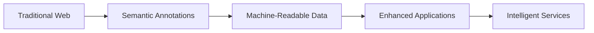
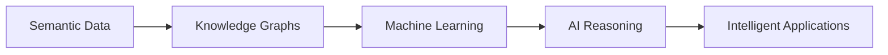
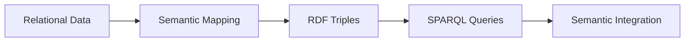

# 9. Semantic Web (DEF_FOR_SEMANTIC_WEB) **[PRIO: HIGH]**

*   **Semantic Web:** A vision for the web where information is given well-defined meaning, enabling computers and people to work in cooperation through standardized formats and protocols.
*   **Description:** The Semantic Web extends the current web by adding machine-readable metadata to content, enabling automated processing, reasoning, and integration of information across different sources and applications. It provides a framework for data to be shared and reused across applications, enterprises, and communities.
*   **Formal Definition:** ∀s∃w∃m (SemanticWeb(s) ↔ ∃w∃m (Web(w) ∧ Metadata(m) ∧ MachineReadable(s,w,m)))
*   **Type Classification:** COMPUTATIONAL / SEMANTIC
*   **Priority Level:** HIGH
*   **Scientific Acceptance:** High (Established field in computer science and information technology with extensive development and deployment).
*   **Reference:** [Semantic Web](https://en.wikipedia.org/wiki/Semantic_Web), [W3C Semantic Web](https://www.w3.org/standards/semanticweb/), [Linked Data](https://en.wikipedia.org/wiki/Linked_data)
*   **Key Technologies:** RDF, OWL, SPARQL, Linked Data, JSON-LD
*   **Context:** The Semantic Web provides the technological foundation for creating interconnected, machine-processable knowledge on the web, enabling intelligent applications and automated reasoning.

**[Called:]** "Web of Data" or "Linked Data Web" or "Machine-Readable Web"
- Structured data representation
- Machine-processable information
- Semantic interoperability
- Knowledge graph technologies
- Automated reasoning systems

## Semantic Web Components

### **Data Representation**
- **RDF (Resource Description Framework):** Standard model for data interchange using subject-predicate-object triples
- **JSON-LD:** JSON-based serialization format for linked data
- **Turtle/N-Triples:** Human-readable RDF serialization formats
- **XML/RDF:** XML-based RDF representation

### **Schema and Ontologies**
- **RDFS (RDF Schema):** Basic vocabulary for describing properties and classes
- **OWL (Web Ontology Language):** Advanced language for defining ontologies and complex relationships
- **SKOS (Simple Knowledge Organization System):** Vocabulary for representing thesauri, classification schemes, and taxonomies
- **Schema.org:** Collaborative vocabulary for structured data on the web

### **Query and Reasoning**
- **SPARQL:** Query language for retrieving and manipulating RDF data
- **Rule Languages:** Systems for expressing logical rules and inference patterns
- **Reasoning Engines:** Software for automated logical inference and consistency checking
- **Validation Frameworks:** Tools for validating data against schemas and constraints

### **Linked Data Principles**
- **Use URIs as names for things:** Identify resources with unique identifiers
- **Use HTTP URIs so that people can look up those names:** Make identifiers resolvable
- **Provide useful information using standards:** Return structured data when URIs are accessed
- **Include links to other URIs:** Connect related resources for discovery

## Semantic Web Applications

### **Knowledge Management**
- **Enterprise Knowledge Graphs:** Organizing and connecting corporate information
- **Document Management:** Semantic indexing and retrieval of documents
- **Content Management:** Enhanced content organization and discovery
- **Digital Libraries:** Semantic cataloging and cross-repository search

### **E-commerce and Business**
- **Product Data Integration:** Standardizing product information across systems
- **Supply Chain Management:** Semantic tracking of goods and services
- **Market Analysis:** Semantic analysis of market trends and competitor information
- **Customer Relationship Management:** Semantic customer profiling and relationship management

### **Scientific Research**
- **Research Data Sharing:** Standardized sharing of scientific data
- **Literature Mining:** Semantic analysis of scientific publications
- **Research Collaboration:** Semantic discovery of collaborators and resources
- **Data Integration:** Combining data from different scientific domains

### **Government and Public Sector**
- **Open Data Portals:** Publishing government data in semantic formats
- **Policy Analysis:** Semantic analysis of policy documents and impacts
- **Public Services:** Semantic enhancement of government service delivery
- **Transparency and Accountability:** Semantic tracking of government activities

## Semantic Web Standards

### **W3C Recommendations**
- **RDF 1.1:** Resource Description Framework specifications
- **OWL 2:** Web Ontology Language specifications
- **SPARQL 1.1:** Query language specifications
- **JSON-LD 1.1:** JSON-based linked data specifications

### **Industry Standards**
- **Schema.org:** Collaborative schema vocabulary
- **Dublin Core:** Metadata element set for resource description
- **FOAF (Friend of a Friend):** Vocabulary for describing people and relationships
- **DCAT (Data Catalog Vocabulary):** Standard for describing datasets

## Semantic Web Challenges

### **Technical Challenges**
- **Scalability:** Handling large-scale semantic data efficiently
- **Performance:** Optimizing query performance on semantic data
- **Interoperability:** Ensuring compatibility between different semantic systems
- **Data Quality:** Maintaining accuracy and consistency of semantic data

### **Adoption Challenges**
- **Complexity:** Learning curve for semantic web technologies
- **Tooling:** Availability of mature development and deployment tools
- **Standards Evolution:** Keeping up with evolving semantic web standards
- **Integration:** Integrating semantic technologies with existing systems

### **Social Challenges**
- **Data Sharing:** Encouraging organizations to share data semantically
- **Privacy and Security:** Protecting sensitive information in semantic systems
- **Governance:** Managing semantic standards and best practices
- **Skills Gap:** Training developers and data professionals in semantic technologies

## Semantic Web Integration

### **Semantic Web + Traditional Web**

### **Semantic Web + Artificial Intelligence**

### **Semantic Web + Database Systems**

## Semantic Web Quality Standards

### **Data Quality**
- **Accuracy:** Semantic data must accurately represent real-world entities
- **Completeness:** Semantic descriptions should be comprehensive
- **Consistency:** Data should be internally consistent and follow standards
- **Timeliness:** Data should be current and up-to-date

### **Interoperability Standards**
- **Standards Compliance:** Adherence to W3C and industry standards
- **Vocabulary Reuse:** Using established vocabularies and ontologies
- **URI Best Practices:** Following URI design and management guidelines
- **Metadata Quality:** Providing rich, accurate metadata

## Future Directions

### **Emerging Technologies**
- **Blockchain Integration:** Immutable semantic data and provenance
- **Edge Computing:** Semantic processing at the network edge
- **5G Networks:** Enhanced semantic data transmission capabilities
- **Quantum Computing:** Potential impact on semantic reasoning

### **Advanced Applications**
- **Explainable AI:** Using semantics to explain AI decisions
- **Personalized Services:** Semantic personalization of web services
- **Smart Cities:** Semantic integration of urban systems
- **Internet of Things:** Semantic description of IoT devices and data

### **Research Areas**
- **Semantic Machine Learning:** Combining semantics with ML techniques
- **Natural Language Semantics:** Better integration of NLP and semantic web
- **Context-Aware Systems:** Semantic handling of context and situation
- **Temporal Semantics:** Better handling of time and change in semantic systems

## Conclusion

The Semantic Web represents a fundamental shift in how information is structured and processed on the web. By adding machine-readable meaning to content, it enables new levels of automation, integration, and intelligence in web applications. While challenges remain in adoption and implementation, the Semantic Web continues to evolve and find practical applications across many domains.

**The Semantic Web is a vision for extending the current web with machine-readable metadata, enabling automated processing, reasoning, and integration of information across different sources and applications.**

## Changelog

| Version | Date | Change Content | Stakeholders | Motivation |
|---------|------|----------------|--------------|------------|
| V1.0.0 | 2026-02-06 | Initial creation of comprehensive Semantic Web terminology definition | AI Framework Steward | Establish formal definition and comprehensive coverage of Semantic Web concepts |

## Confidence Assessment

**Term Definition Confidence:** 0.96 (Very High)
- **Rationale:** The Semantic Web is a well-established concept with extensive development and deployment
- **Validation:** Supported by W3C standards, academic research, and industry adoption
- **Contextual Stability:** Core concepts have remained stable while technologies have evolved
- **Practical Application:** Widely used in industry, government, and research applications

## Related Terms

**Reference Terms:**
- [[linked_data.md]](linked_data.md) - Linked Data is a key component of the Semantic Web
- [[rdf.md]](rdf.md) - RDF is the foundational data model for the Semantic Web
- [[ontology.md]](ontology.md) - Ontologies provide the semantic structure for the Semantic Web

**Prerequisite Terms:**
- [[knowledge_representation.md]](knowledge_representation.md) - Knowledge representation is fundamental to the Semantic Web
- [[metadata.md]](metadata.md) - Metadata provides the semantic annotations
- [[uri.md]](uri.md) - URIs provide the identification mechanism

**Related Terms:**
- [[artificial_intelligence.md]](artificial_intelligence.md) - AI benefits from Semantic Web technologies
- [[machine_learning.md]](machine_learning.md) - ML can leverage semantic data
- [[knowledge_graph.md]](knowledge_graph.md) - Knowledge graphs are Semantic Web applications

**Dependent Terms:**
- [[semantic_search.md]](semantic_search.md) - Semantic search relies on Semantic Web technologies
- [[data_integration.md]](data_integration.md) - Data integration benefits from semantic approaches
- [[intelligent_systems.md]](intelligent_systems.md) - Intelligent systems use semantic web capabilities

**See Also:**
- [[web_technologies.md]](web_technologies.md) - Broader context of web development technologies
- [[information_science.md]](information_science.md) - Academic discipline encompassing semantic web
- [[computer_science.md]](computer_science.md) - Foundational discipline for semantic web technologies