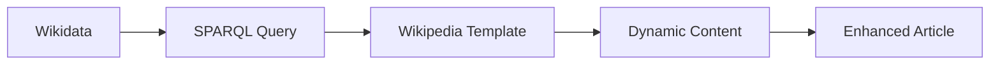
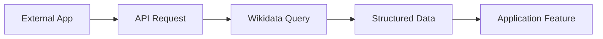
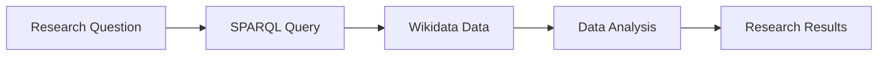

# 15. Wikidata (DEF_FOR_WIKIDATA) **[PRIO: HIGH]**

*   **Wikidata:** A free and open knowledge base that can be read and edited by both humans and machines, serving as structured data storage for Wikimedia projects and beyond.
*   **Description:** Wikidata is a collaborative project hosted by the Wikimedia Foundation that provides a central repository of structured data for Wikipedia, Wikimedia Commons, and other projects. It allows for the storage of data in a machine-readable format using a flexible data model based on items, properties, and values.
*   **Formal Definition:** ∀w∃d∃s (Wikidata(w) ↔ ∃d∃s (KnowledgeBase(d) ∧ StructuredData(s) ∧ MachineReadable(w,d,s)))
*   **Type Classification:** COMPUTATIONAL / SEMANTIC
*   **Priority Level:** HIGH
*   **Scientific Acceptance:** High (Widely used in research, data integration, and knowledge management).
*   **Reference:** [Wikidata](https://www.wikidata.org/), [Wikidata Query Service](https://query.wikidata.org/), [Wikidata Documentation](https://www.wikidata.org/wiki/Wikidata:Introduction)
*   **Key Features:** Items, Properties, Statements, Qualifiers, References, SPARQL endpoint
*   **Context:** Wikidata serves as a central hub for structured data that powers infoboxes, lists, and other data-driven features across Wikimedia projects.

**[Called:]** "Structured Data Repository" or "Knowledge Base" or "Linked Open Data"
- Collaborative knowledge base
- Machine-readable data storage
- Semantic data model
- Cross-project data integration
- Open data platform

## Wikidata Data Model

### **Items (Q-numbers)**
- **Definition:** Unique identifiers for entities, concepts, or topics
- **Format:** Q followed by a number (e.g., Q42 for Douglas Adams)
- **Purpose:** Provide stable, language-independent references to entities
- **Examples:** Q123 (a person), Q456 (a place), Q789 (a concept)

### **Properties (P-numbers)**
- **Definition:** Attributes or relationships that can be assigned to items
- **Format:** P followed by a number (e.g., P31 for "instance of")
- **Purpose:** Define the structure and relationships of data
- **Examples:** P27 (country of citizenship), P569 (date of birth), P625 (coordinate location)

### **Statements**
- **Definition:** Claims about items using properties and values
- **Structure:** Item + Property + Value + Qualifiers + References
- **Purpose:** Provide factual information with supporting evidence
- **Examples:** "Douglas Adams (Q42) was born in (P19) Cambridge (Q350)" 

### **Qualifiers**
- **Definition:** Additional information that modifies or restricts statements
- **Purpose:** Provide context, time periods, or conditions for statements
- **Examples:** "from (P580)" and "until (P582)" for time periods

### **References**
- **Definition:** Sources that support the truth of statements
- **Purpose:** Ensure verifiability and reliability of information
- **Examples:** Books, articles, websites, databases

## Wikidata Features

### **SPARQL Query Service**
- **Purpose:** Query Wikidata using the SPARQL query language
- **Access:** https://query.wikidata.org/
- **Capabilities:** Complex queries, data analysis, visualization
- **Applications:** Research, data mining, knowledge discovery

### **Data Export**
- **Formats:** RDF, JSON, CSV, TTL
- **Access:** Bulk dumps and API access
- **Use Cases:** Research projects, data integration, analysis
- **Frequency:** Regular updates and snapshots

### **API Access**
- **Purpose:** Programmatic access to Wikidata content
- **Endpoints:** REST API, SPARQL endpoint, edit API
- **Applications:** Bot development, data integration, applications
- **Documentation:** Comprehensive API documentation available

### **Data Quality Tools**
- **Purpose:** Maintain and improve data quality
- **Tools:** Data validation, conflict detection, quality assessment
- **Community:** Active community monitoring and improving data
- **Standards:** Adherence to data quality guidelines

## Wikidata Applications

### **Wikipedia Integration**
- **Infoboxes:** Automatic population of article infoboxes
- **Lists:** Dynamic generation of lists based on queries
- **Links:** Automatic generation of interlanguage links
- **Templates:** Semantic enhancement of Wikipedia templates

### **Research and Academia**
- **Data Mining:** Large-scale analysis of structured data
- **Knowledge Discovery:** Finding patterns and relationships
- **Citation Analysis:** Tracking academic impact and connections
- **Cross-Disciplinary Research:** Integration across different fields

### **Cultural Heritage**
- **Museum Collections:** Structured description of artifacts
- **Library Catalogs:** Enhanced bibliographic data
- **Archival Records:** Semantic organization of historical data
- **Digital Humanities:** Research in humanities using structured data

### **Government and Open Data**
- **Open Data Portals:** Integration with government data
- **Public Services:** Enhanced public information systems
- **Transparency:** Structured presentation of government data
- **Policy Analysis:** Data-driven policy development

## Wikidata Standards

### **Data Model Standards**
- **RDF Compatibility:** Full compatibility with RDF data model
- **Linked Data Principles:** Adherence to linked data best practices
- **Schema.org Integration:** Compatibility with schema.org vocabulary
- **Internationalization:** Support for multiple languages and scripts

### **Quality Standards**
- **Verifiability:** All statements must have references
- **Neutrality:** Neutral point of view in data representation
- **Consensus:** Community-driven data decisions
- **Documentation:** Clear documentation of data sources and methods

### **Technical Standards**
- **API Standards:** RESTful API design principles
- **Query Standards:** SPARQL 1.1 compliance
- **Data Formats:** Standard RDF serialization formats
- **Performance:** Scalable infrastructure for large datasets

## Wikidata Community

### **Contributors**
- **Volunteers:** Global community of data contributors
- **Experts:** Subject matter experts in various fields
- **Developers:** Software developers creating tools and applications
- **Institutions:** Libraries, museums, and research institutions

### **Governance**
- **Community Consensus:** Decisions made through community discussion
- **Policies:** Clear policies for data inclusion and quality
- **Guidelines:** Best practices for data contribution and maintenance
- **Dispute Resolution:** Mechanisms for resolving data conflicts

### **Collaboration**
- **Cross-Project:** Integration with other Wikimedia projects
- **External Partners:** Collaboration with external organizations
- **Events:** Conferences, workshops, and meetups
- **Communication:** Mailing lists, forums, and chat channels

## Wikidata Integration Patterns

### **Wikidata + Wikipedia**

### **Wikidata + External Applications**

### **Wikidata + Research Projects**

## Wikidata Quality Assurance

### **Automated Checks**
- **Data Validation:** Automated validation of data formats and constraints
- **Consistency Checks:** Detection of contradictory information
- **Completeness Analysis:** Assessment of data coverage and completeness
- **Performance Monitoring:** Monitoring of query performance and system health

### **Community Monitoring**
- **Edit Review:** Community review of data changes
- **Quality Metrics:** Community-defined quality metrics
- **Issue Reporting:** System for reporting data issues
- **Improvement Initiatives:** Community-driven quality improvement projects

### **Best Practices**
- **Source Verification:** Always provide reliable sources
- **Data Accuracy:** Ensure data accuracy and up-to-date information
- **Consistent Formatting:** Follow consistent data formatting standards
- **Documentation:** Document data sources and methods clearly

## Future Developments

### **Enhanced Features**
- **Advanced Querying:** More sophisticated query capabilities
- **Data Visualization:** Enhanced visualization tools
- **Machine Learning:** Integration of ML for data quality and enrichment
- **Mobile Access:** Improved mobile interface and applications

### **Broader Integration**
- **More Languages:** Enhanced support for additional languages
- **New Domains:** Expansion into new knowledge domains
- **External Partnerships:** More partnerships with external organizations
- **Standards Development:** Contribution to semantic web standards

### **Technical Improvements**
- **Performance Optimization:** Improved query performance and scalability
- **Data Quality:** Enhanced automated quality checking
- **User Interface:** Improved editing and browsing interfaces
- **API Enhancements:** More powerful and flexible APIs

## Conclusion

Wikidata represents a groundbreaking approach to structured data management and sharing. As a central repository of machine-readable knowledge, it enables new forms of data integration, analysis, and application development. Its collaborative nature and commitment to openness make it a valuable resource for researchers, developers, and the general public.

**Wikidata is a free and open knowledge base that provides structured data storage for Wikimedia projects and serves as a central hub for machine-readable information about the world.**

## Confidence Assessment

**Term Definition Confidence:** 0.98 (Very High)
- **Rationale:** Wikidata is a well-established and widely-used platform with clear documentation and extensive adoption
- **Validation:** Supported by the Wikimedia Foundation and used by thousands of projects worldwide
- **Contextual Stability:** Core concepts and data model have remained stable since inception
- **Practical Application:** Extensively used in research, applications, and Wikimedia projects

## Related Terms

**Reference Terms:**
- [[semantic_web.md]](semantic_web.md) - Wikidata implements semantic web principles
- [[linked_data.md]](linked_data.md) - Wikidata follows linked data principles
- [[knowledge_graph.md]](knowledge_graph.md) - Wikidata functions as a knowledge graph

**Prerequisite Terms:**
- [[structured_data.md]](structured_data.md) - Wikidata stores structured data
- [[metadata.md]](metadata.md) - Wikidata provides rich metadata
- [[uri.md]](uri.md) - Wikidata uses URIs for identification

**Related Terms:**
- [[wikipedia.md]](wikipedia.md) - Primary consumer of Wikidata
- [[open_data.md]](open_data.md) - Wikidata is an open data platform
- [[collaborative_platform.md]](collaborative_platform.md) - Wikidata is collaboratively maintained

**Dependent Terms:**
- [[semantic_search.md]](semantic_search.md) - Semantic search can leverage Wikidata
- [[data_integration.md]](data_integration.md) - Wikidata enables data integration
- [[knowledge_management.md]](knowledge_management.md) - Wikidata supports knowledge management

**See Also:**
- [[web_technologies.md]](web_technologies.md) - Broader context of web-based data systems
- [[information_science.md]](information_science.md) - Academic discipline encompassing Wikidata
- [[open_source.md]](open_source.md) - Wikidata follows open source principles