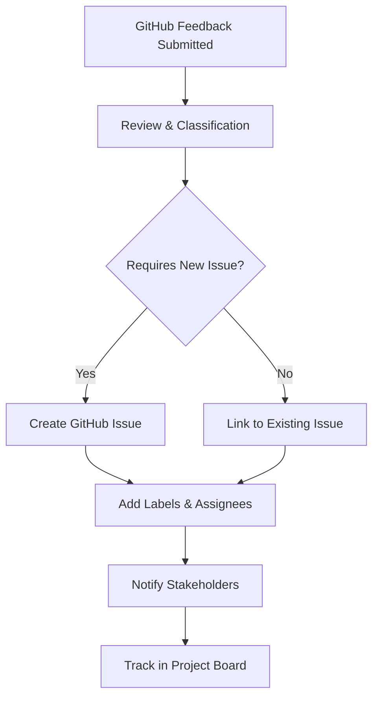

# GitHub Feedback Example [FB_MFW_GITHUB] **[PRIO: HIGH]**

**Version: V1.0.1** **Status: APPROVED** **Date: 2026-01-23**
**Scope:** Specialized feedback template designed for GitHub integration

**Purpose:** Specialized feedback template designed for GitHub integration, allowing users to provide feedback with full GitHub feature support including issues, pull requests, discussions, and GitHub-specific formatting.

---

## 📝 GitHub Feedback Submission

```markdown
# GitHub Feedback **[GITHUB_[YYYYMMDD]_[ISSUE_TYPE]]**

**Date:** [YYYY-MM-DD]
**From:** [Your GitHub Username] (@[username])
**Repository:** [Repository Name]
**Issue Type:** [bug/enhancement/question/discussion/documentation]

---

## 🎯 Your Feedback

[Write your GitHub-specific feedback here]

**GitHub Features Supported:**
- **Issue References**: Use `#123` to reference issues
- **Pull Request References**: Use `PR #456` to reference PRs
- **User Mentions**: Use `@username` to mention users
- **Code References**: Use backticks for `inline code`
- **Emoji Support**: Use GitHub emoji shortcuts like `:tada:`
- **Markdown Formatting**: Full GitHub Flavored Markdown support

---

## 📌 GitHub-Specific Details

### **Issue Information** (if applicable)
- **Issue Number:** #[number]
- **Issue URL:** [https://github.com/...]
- **Related Issues:** #[number1], #[number2]

### **Pull Request Information** (if applicable)
- **PR Number:** #PR[number]
- **PR URL:** [https://github.com/...]
- **Review Status:** [draft/ready/approved/merged]

### **Code References**
```markdown
**File:** `path/to/file.ext`
**Line:** [line number]
**Commit:** [commit hash]
**Branch:** [branch name]
```

---

## 🔍 GitHub Integration Features

### **GitHub Flavored Markdown Examples**
```markdown
- [x] Task lists
- [ ] Incomplete task
- [x] Completed task

```javascript
// Code blocks with syntax highlighting
function example() {
  return "GitHub syntax highlighting";
}
```

| Tables | Are | Supported |
|--------|-----|-----------|
| Column 1 | Column 2 | Column 3 |

> Blockquotes for emphasis
>
> Multiple lines supported
```

### **GitHub Actions & Workflows**
```yaml
# Example workflow reference
name: CI
on: [push, pull_request]
jobs:
  test:
    runs-on: ubuntu-latest
    steps:
      - uses: actions/checkout@v2
      - run: npm test
```

---

## 📋 GitHub Feedback Guidelines

### **Best Practices for GitHub Feedback**
1. **Reference Related Issues**: Always link to relevant GitHub issues/PRs
2. **Use Proper Formatting**: Leverage GitHub Flavored Markdown
3. **Mention Relevant Users**: Use `@mentions` for stakeholders
4. **Include Context**: Provide repository, branch, commit info
5. **Use Labels Appropriately**: Suggest relevant labels

### **Feedback Types**
| Type | GitHub Equivalent | Example |
|------|-------------------|---------|
| **Bug Report** | Issue (bug) | `#123 [bug] Template rendering issue` |
| **Feature Request** | Issue (enhancement) | `#456 [enhancement] Add dark mode` |
| **Question** | Discussion | `Discussion #789: Template usage` |
| **Documentation** | Issue (docs) | `#234 [docs] Update README` |
| **Pull Request** | PR | `PR #567: Fix template validation` |

---

## 🚀 GitHub Workflow Integration

### **Feedback → GitHub Issue Creation**


---

## 🔗 Related GitHub Resources

- **GitHub Documentation**: [https://docs.github.com](https://docs.github.com)
- **GitHub API**: [https://developer.github.com/v3](https://developer.github.com/v3)
- **GitHub Actions**: [https://github.com/features/actions](https://github.com/features/actions)
- **GitHub Flavored Markdown**: [https://github.github.com/gfm](https://github.github.com/gfm)

---

## 📝 Example GitHub Feedback

```markdown
# GitHub Feedback **[GITHUB_20260112_TEMPLATE_ISSUE]**

**Date:** 2026-01-12
**From:** @framework-user
**Repository:** MODEL_for_framework
**Issue Type:** enhancement

---

## 🎯 Your Feedback

I love the new template system! It would be great if we could integrate it more deeply with GitHub Actions. Specifically, I'd like to see:

1. **Automatic Issue Creation**: When feedback is submitted, auto-create GitHub issues
2. **PR Template Validation**: Validate PRs against our template standards
3. **Action-Based Workflows**: Trigger workflows based on feedback type

**Related Issues:** #123, #456
**Mentioning:** @framework-maintainer @docs-team

---

## 📌 GitHub-Specific Details

### **Proposed Implementation**
```yaml
name: Template Feedback Processor
on:
  issues:
    types: [opened, labeled]
  pull_request:
    types: [opened, synchronize]

jobs:
  process-feedback:
    runs-on: ubuntu-latest
    steps:
      - uses: actions/checkout@v2
      - uses: framework/template-validator@v1
        with:
          feedback-file: ${{ github.event.issue.body }}
          labels: "feedback, template, needs-review"
```

---

**Rule Steward:** Terminology Architects
**Approval Status:** Framework Approved
**Effective Date:** 2026-01-08
**Review Cycle:** Annual

**Framework:** MODEL_for_framework
**Framework Version:** V1.0.1
**Date:** 2026-01-23

## Changelog

| Version | Date | Change Content | Stakeholders | Rationale/Motivation |
|---------|------|---------|-------------|----------------------|
| V1.0.1 | 2026-01-23 | Updated title formatting and changed metadata headers per RULE_FOR_MFW_TITLE_FORMAT | Framework Admin | Ensure framework-wide consistency |
| V1.0.0 | 2026-01-12 | Initial creation | AI Framework Steward | Establish foundation for GitHub feedback |