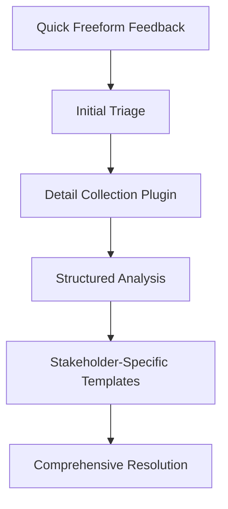
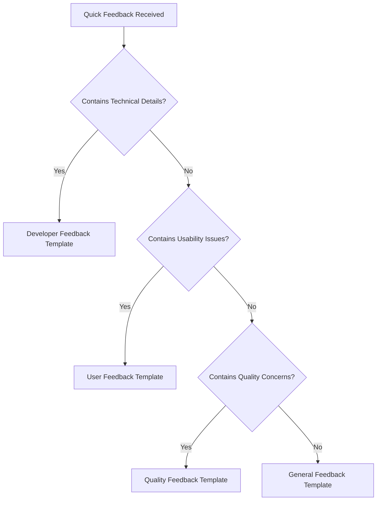
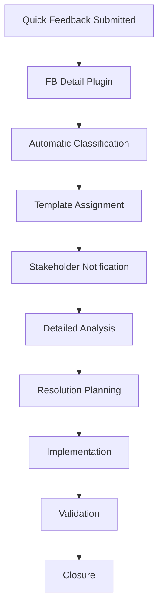

# Feedback Detail Plugin [PLUGIN_MFW_FB_OT_DETAIL] [PRIO: HIGH]

**Version: V1.0.0** **Date: 2026-01-12**

**Purpose:** Comprehensive feedback detail plugin that collects and organizes all feedback components, providing a structured approach that typically starts with minimal freeform input and can escalate to detailed analysis.

---

## 🎯 Plugin Overview

The **FB Detail Plugin** provides a complete feedback collection and processing system that supports the natural progression from quick, informal feedback to structured, detailed analysis.



---

## 🗂️ Plugin Structure

```
40_feedback/
├── 05_quick_feedback_example.md      # Starting point: minimal freeform
├── 08_fb_detail_plugin.md            # This comprehensive plugin
├── 10_user_feedback/                 # User-specific detailed feedback
├── 20_developer_feedback/            # Developer-specific detailed feedback
├── 30_quality_feedback/              # Quality-specific detailed feedback
├── 40_general_feedback/              # General detailed feedback
├── 50_bug_reports/                   # Detailed bug reporting
├── 60_feature_requests/              # Detailed feature requests
└── 90_templates/                     # All feedback templates
```

---

## 🚀 Feedback Progression Workflow

### **1. Quick Start (Minimal Freeform)**
```markdown
# Quick Feedback **[FB_QUICK_[YYYYMMDD]]**

**Date:** [YYYY-MM-DD]
**From:** [Your Name/Contact - Optional]

---

## 🎯 Your Feedback

[Write your feedback here - completely freeform!]

This can be:
- A quick suggestion
- A bug report
- A feature idea
- General praise or criticism
- Anything you want to share!
```

### **2. Detail Collection (Plugin Processing)**
The FB Detail Plugin processes quick feedback and:
- **Categorizes** the feedback type
- **Identifies** stakeholder relevance
- **Suggests** appropriate detailed template
- **Preserves** original freeform content
- **Adds** structured analysis framework

### **3. Structured Analysis (Plugin Enhancement)**
```markdown
# Enhanced Feedback Analysis **[FB_DETAIL_[YYYYMMDD]]**

**Original Quick Feedback ID:** [FB_QUICK_XXXXXX]
**Date Processed:** [YYYY-MM-DD]
**Processed By:** [Plugin/Steward Name]
**Feedback Category:** [User/Developer/Quality/General/Bug/Feature]

---

## 🔍 Detailed Analysis

### **Original Freeform Content**
```quote
[Preserved original quick feedback text]
```

### **Structured Breakdown**
| Aspect | Analysis | Recommendation |
|--------|----------|----------------|
| **Stakeholder Impact** | [Who is affected] | [Suggested stakeholders] |
| **Component Affected** | [Framework area] | [Specific files/components] |
| **Priority Assessment** | [Low/Medium/High] | [Justification] |
| **Principle Alignment** | [Relevant principles] | [Compliance status] |

### **Context Enhancement**
- **Related Components:** [Auto-identified related files]
- **Similar Issues:** [Database lookup results]
- **Impact Assessment:** [Scope and severity analysis]

---

## 🎯 Actionable Items

### **Next Steps**
1. [Step 1: Detailed description]
2. [Step 2: Assignment recommendations]
3. [Step 3: Implementation timeline]

### **Escalation Path**
- **Minor Issues:** → Quick resolution workflow
- **Major Issues:** → Full stakeholder template
- **Critical Issues:** → Immediate steward review

---

## 📊 Metrics and Tracking

**Processing Metrics:**
- **Response Time:** [Hours from submission]
- **Analysis Depth:** [Basic/Intermediate/Advanced]
- **Stakeholder Engagement:** [Number of stakeholders involved]
- **Resolution Path:** [Quick/Detailed/Escalated]
```

---

## 📋 Feedback Detail Templates Collection

### **1. User Feedback Template**
**Location:** `90_templates/20_user_feedback_template.md`
**Purpose:** Detailed usability and user experience analysis
**Key Sections:** Usability ratings, documentation feedback, learning curve assessment

### **2. Developer Feedback Template**
**Location:** `90_templates/30_developer_feedback_template.md`
**Purpose:** Technical implementation and architecture analysis
**Key Sections:** Code quality assessment, tooling feedback, integration challenges

### **3. Quality Feedback Template**
**Location:** `90_templates/40_quality_feedback_template.md`
**Purpose:** Compliance validation and quality assurance
**Key Sections:** Principle compliance review, validation metrics, process improvements

### **4. General Feedback Template**
**Location:** `90_templates/10_feedback_template.md`
**Purpose:** Comprehensive framework suggestions
**Key Sections:** Impact assessment, evaluation criteria, success metrics

---

## 🔧 Plugin Processing Rules

### **Automatic Classification**


### **Escalation Criteria**
| Condition | Action | Template |
|-----------|--------|----------|
| Mentions specific code/files | Auto-classify as Developer | Developer Template |
| Reports usability difficulties | Auto-classify as User | User Template |
| References principles/rules | Auto-classify as Quality | Quality Template |
| General suggestions | Auto-classify as General | General Template |
| Urgent/critical issues | Immediate Steward Review | Custom Template |

---

## 📊 Plugin Performance Metrics

### **Processing Efficiency**
- **Quick → Detailed Conversion Time:** ≤ 24 hours
- **Automatic Classification Accuracy:** ≥ 90%
- **Stakeholder Routing Success:** ≥ 95%
- **Feedback Enhancement Rate:** ≥ 80% of quick feedbacks enhanced

### **Quality Metrics**
- **Stakeholder Satisfaction:** ≥ 4.5/5
- **Resolution Accuracy:** ≥ 85%
- **Principle Compliance:** 100% of processed feedback
- **Accessibility Compliance:** 100% WCAG 2.1 AA adherence

---

## 🎯 Plugin Integration Points

### **Feedback Workflow Integration**


### **Framework Integration**
- **Principle of Accessibility:** Ensures all plugin outputs meet WCAG standards
- **Principle of Reuse:** Plugin reuses existing templates and structures
- **Continuous Learning:** Plugin improves based on feedback patterns
- **Quality Assurance:** Plugin validates all processed feedback

---

## 📝 Plugin Usage Examples

### **Example 1: Quick → Detailed Escalation**
```markdown
# Original Quick Feedback
**ID:** FB_QUICK_20260112_001
**Content:** "The template system is confusing for new users"

# Plugin Processed Feedback
**ID:** FB_DETAIL_20260112_001
**Category:** User Experience
**Template:** User Feedback Template
**Enhanced Analysis:**
- Impact: New user onboarding
- Related: Template documentation
- Priority: High
- Recommendation: Create visual guide
```

### **Example 2: Technical Issue Escalation**
```markdown
# Original Quick Feedback
**ID:** FB_QUICK_20260112_002
**Content:** "The YAML converter has issues with nested structures"

# Plugin Processed Feedback
**ID:** FB_DETAIL_20260112_002
**Category:** Technical Implementation
**Template:** Developer Feedback Template
**Enhanced Analysis:**
- Component: yaml_to_html_converter.py
- Impact: Data integrity
- Priority: Critical
- Recommendation: Code review and testing
```

---

## 🔗 Related Framework Elements

- **Quick Feedback Example:** `05_quick_feedback_example.md`
- **Feedback Workflow:** `70_feedback_process/10_feedback_workflow.md`
- **Principle of Accessibility:** `../25_principle/12_principle_of_accessibility.md`
- **Framework Stewardship:** `../25_principle/14_principle_of_framework_stewardship.md`

---

**Framework:** MODEL_for_framework
**License:** EUPL v1.2
**Status:** ACTIVE
**Plugin Type:** Feedback Processing Engine
**Integration Level:** Core Framework Component