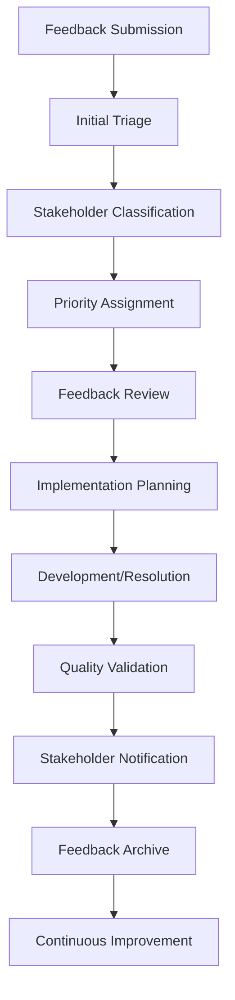
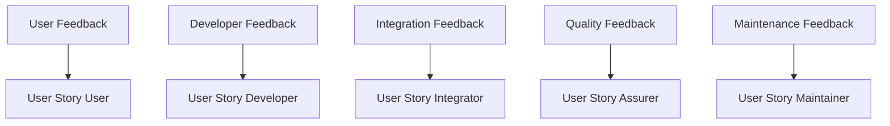
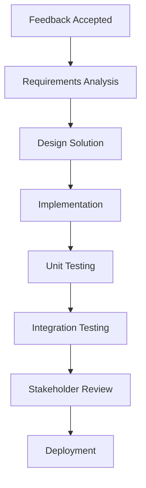
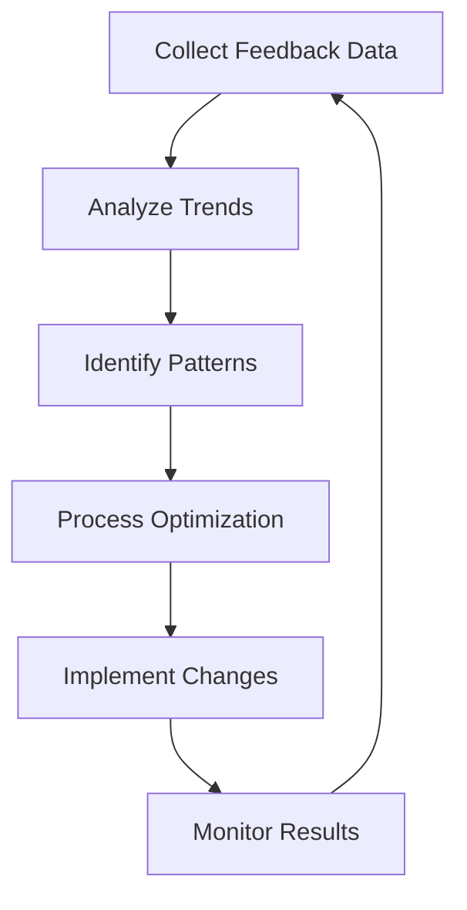

# Feedback Workflow **[FEEDBACK_WORKFLOW]** **[PRIO: HIGH]**

**Version: V1.0.0** **Date: 2026-01-12**

**Purpose:** Comprehensive workflow for handling feedback from submission to resolution, integrating with existing user stories and stakeholder processes.

---

## 📋 Feedback Lifecycle



---

## 🎯 Feedback Submission Process

### **Submission Channels**
| Stakeholder Type | Recommended Template | Submission Location |
|------------------|----------------------|---------------------|
| Users | User Feedback Template | `40_feedback/10_user_feedback/` |
| Developers | Developer Feedback Template | `40_feedback/20_developer_feedback/` |
| Integrators | Developer Feedback Template | `40_feedback/20_developer_feedback/` |
| Assurers | Quality Feedback Template | `40_feedback/30_quality_feedback/` |
| Maintainers | Quality Feedback Template | `40_feedback/30_quality_feedback/` |
| Contributors | General Feedback Template | `40_feedback/40_general_feedback/` |
| All Stakeholders | Bug Reports | `40_feedback/50_bug_reports/` |
| All Stakeholders | Feature Requests | `40_feedback/60_feature_requests/` |

### **Submission Guidelines**
1. **Use Appropriate Template**: Select the template that matches your stakeholder type
2. **Provide Complete Information**: Fill all relevant sections of the template
3. **Follow Naming Convention**: `FEEDBACK_[TYPE]_[YYYYMMDD]_[SHORT_DESCRIPTION].md`
4. **Include References**: Link to related framework components
5. **Set Priority**: Indicate urgency (Low/Medium/High/Critical)

---

## 🔍 Initial Triage Process

### **Triage Team Responsibilities**
- **Review completeness** of feedback submission
- **Validate stakeholder** information
- **Assess initial priority** based on impact
- **Assign feedback ID** for tracking
- **Categorize feedback** appropriately

### **Triage Criteria**
| Criteria | Assessment Factors |
|----------|--------------------|
| **Completeness** | Template sections filled, required fields present |
| **Clarity** | Clear description, understandable issue/suggestion |
| **Impact** | Number of stakeholders affected, severity |
| **Urgency** | Time sensitivity, business impact |
| **Alignment** | Fit with framework principles and goals |

---

## 📊 Priority Assignment Matrix

| Impact \ Urgency | Low | Medium | High | Critical |
|-----------------|-----|--------|------|----------|
| **Minor** | P4 | P3 | P2 | P1 |
| **Moderate** | P3 | P2 | P1 | P1 |
| **Major** | P2 | P1 | P1 | P0 |
| **Critical** | P1 | P1 | P0 | P0 |

**Priority Levels:**
- **P0**: Immediate action required (blocking issues)
- **P1**: High priority (current sprint)
- **P2**: Medium priority (next sprint)
- **P3**: Low priority (backlog)
- **P4**: Nice-to-have (future consideration)

---

## 🎯 Stakeholder Integration Workflow

### **User Story Integration**
| User Story | Feedback Integration Points |
|------------|-----------------------------|
| **User** | Usability feedback, documentation improvements |
| **Developer** | Technical feedback, tool improvements |
| **Integrator** | Integration challenges, pattern suggestions |
| **Implementer** | Real-world application feedback |
| **Assurer** | Quality validation, compliance feedback |
| **Maintainer** | Maintenance challenges, sustainability feedback |
| **Contributor** | General suggestions, community input |

### **Feedback to User Story Mapping**


---

## 🔗 Feedback Resolution Process

### **Implementation Planning**
1. **Assign Owner**: Designate responsible team/stakeholder
2. **Create Task**: Generate implementation task in project management
3. **Set Timeline**: Establish realistic delivery dates
4. **Allocate Resources**: Assign necessary personnel and tools
5. **Document Plan**: Record implementation approach

### **Development Workflow**


---

## 📝 Quality Validation Process

### **Validation Checklist**
- [ ] Solution addresses original feedback
- [ ] All framework principles maintained
- [ ] No regression in existing functionality
- [ ] Documentation updated appropriately
- [ ] Cross-references maintained
- [ ] Testing coverage adequate
- [ ] Performance impact acceptable

### **Validation Roles**
| Role | Responsibility |
|------|----------------|
| **Assurer** | Principle compliance validation |
| **Maintainer** | Framework integrity verification |
| **Developer** | Technical implementation review |
| **User Representative** | Usability validation |
| **Quality Engineer** | Test coverage verification |

---

## 🎯 Stakeholder Notification Process

### **Notification Template**
```markdown
# Feedback Resolution Notification **[FEEDBACK_[ID]_RESOLUTION]**

**Date:** [YYYY-MM-DD]
**Feedback ID:** [Original Feedback ID]
**Original Submitter:** [Stakeholder Name]
**Resolution Status:** [Implemented/Rejected/Deferred]

---

## 📋 Resolution Summary

### **Original Feedback**
[Brief summary of original feedback]

### **Resolution Details**
[Detailed description of implemented solution]

### **Changes Made**
- **Component Modified:** [File paths]
- **Changes Summary:** [Brief description]
- **Impact Assessment:** [Stakeholder impact]

---

## 🔍 Validation Results

### **Compliance Verification**
| Principle | Compliance Status | Notes |
|-----------|-------------------|-------|
| Human Sovereignty | [✓/✗] | [Notes] |
| Transparency | [✓/✗] | [Notes] |
| [Other Principles] | [✓/✗] | [Notes] |

### **Testing Results**
- **Test Coverage:** [Percentage]
- **Tests Passed:** [Number]
- **Tests Failed:** [Number]
- **Regression Tests:** [Results]

---

## 📊 Impact Assessment

### **Stakeholder Impact**
| Stakeholder Type | Impact Level | Benefits |
|------------------|--------------|----------|
| Users | [Low/Medium/High] | [Benefits] |
| Developers | [Low/Medium/High] | [Benefits] |
| [Other Stakeholders] | [Low/Medium/High] | [Benefits] |

### **Framework Metrics**
- **Improvement Area:** [Specific metric]
- **Before:** [Value]
- **After:** [Value]
- **Improvement:** [Percentage]

---

## 🔗 Related Changes

### **Modified Components**
- [Component 1]: [Change description]
- [Component 2]: [Change description]

### **New Components**
- [New Component 1]: [Purpose]
- [New Component 2]: [Purpose]

### **Documentation Updates**
- [Updated Documentation 1]
- [Updated Documentation 2]

---

## 📝 Feedback on Resolution

**Stakeholder Satisfaction:**
- [ ] Resolves original issue completely
- [ ] Partially resolves issue
- [ ] Does not resolve issue

**Additional Comments:**
[Stakeholder feedback on resolution]

---

**Framework:** MODEL_for_framework
**License:** EUPL v1.2
**Status:** [Resolved/Closed]
**Related User Stories:** [Links to affected user stories]
```

---

## 📊 Continuous Improvement Process

### **Feedback Analytics**
| Metric | Target | Current | Trend |
|--------|--------|---------|-------|
| Response Time | ≤72h | [Value] | [↑/↓/→] |
| Resolution Rate | ≥80% | [Value] | [↑/↓/→] |
| Stakeholder Satisfaction | ≥4/5 | [Value] | [↑/↓/→] |
| Implementation Time | ≤2 weeks | [Value] | [↑/↓/→] |

### **Process Improvement Cycle**


---

## 🔗 Integration with Existing Processes

### **User Story Enhancement**
- Add feedback collection points to each user story
- Include feedback validation in acceptance criteria
- Establish feedback metrics for user story success

### **Principle Compliance**
- Ensure feedback process aligns with all 12 principles
- Use feedback to validate principle effectiveness
- Update principles based on stakeholder input

### **Continuous Learning**
- Incorporate feedback insights into framework evolution
- Use feedback data for principle refinement
- Establish feedback-driven improvement cycles

---

**Framework:** MODEL_for_framework
**License:** EUPL v1.2
**Status:** ACTIVE
**Related Principles:** [Continuous Learning, Quality Assurance, Iterative Validation]