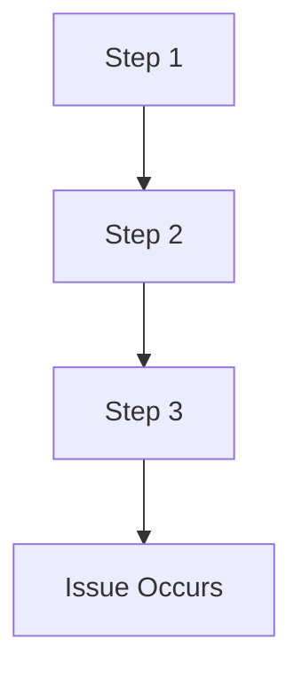

# Feedback Template **[FEEDBACK_TEMPLATE]** **[PRIO: HIGH]**

**Version: V1.0.0** **Date: 2026-01-12**

**Purpose:** Standardized template for providing structured feedback across all stakeholder types.

---

## 📝 Feedback Submission Template

```markdown
# [Feedback Type] Feedback **[FEEDBACK_ID]** **[PRIO: MEDIUM/HIGH/CRITICAL]**

**Version: V1.0.0** **Date: [YYYY-MM-DD]**

**Stakeholder Type:** [User/Developer/Integrator/Implementer/Assurer/Maintainer/Contributor]
**Stakeholder Name:** [Your Name/Organization]
**Contact Information:** [Email/Contact Method]

---

## 📋 Feedback Details

### **Feedback Category**
- [ ] User Experience
- [ ] Technical Implementation
- [ ] Documentation
- [ ] Framework Structure
- [ ] Process Improvement
- [ ] Bug Report
- [ ] Feature Request
- [ ] Other: [Specify]

### **Affected Component**
- **Component Type:** [Principle/Rule/Convention/Template/Tool/Other]
- **Component Location:** [File path or URL]
- **Component Version:** [If applicable]

---

## 🎯 Feedback Content

### **Description**
[Provide a clear, concise description of the feedback, issue, or suggestion]

### **Current Behavior** (For bugs/issues)
[Describe what currently happens]

### **Expected Behavior** (For bugs/issues)
[Describe what should happen]

### **Proposed Solution** (For suggestions)
[Describe your proposed solution or improvement]

### **Impact Assessment**
- **Scope:** [Minor/Major/Critical]
- **Affected Stakeholders:** [List stakeholder types impacted]
- **Urgency:** [Low/Medium/High]

---

## 🔍 Context and Examples

### **Reproduction Steps** (For bugs)


### **Code/Content Examples**
```markdown
[Provide relevant code snippets, configuration examples, or content samples]
```

### **Screenshots/Attachments**
- [ ] Screenshot attached
- [ ] Log files attached
- [ ] Configuration files attached
- [ ] Other attachments: [List]

---

## 📊 Evaluation Criteria

### **Alignment with Framework Principles**
| Principle | Alignment Score (1-5) | Rationale |
|-----------|----------------------|-----------|
| Human Sovereignty | [1-5] | [Explanation] |
| Transparency | [1-5] | [Explanation] |
| Proportionality | [1-5] | [Explanation] |
| Accountability | [1-5] | [Explanation] |
| Iterative Validation | [1-5] | [Explanation] |
| Context Preservation | [1-5] | [Explanation] |

### **Implementation Feasibility**
- **Complexity:** [Low/Medium/High]
- **Estimated Effort:** [Hours/Days/Weeks]
- **Dependencies:** [List any dependencies]
- **Risk Assessment:** [Low/Medium/High]

---

## 🎯 Success Metrics

**Proposed Success Criteria:**
1. [Metric 1 with target value]
2. [Metric 2 with target value]
3. [Metric 3 with target value]

**Measurement Method:**
[Describe how success will be measured]

---

## 🔗 Related Framework Elements

- **Related Principles:** [List relevant principles]
- **Related Rules:** [List relevant rules]
- **Related Conventions:** [List relevant conventions]
- **Related Templates:** [List relevant templates]
- **Related User Stories:** [List relevant user stories]

---

## 📝 Additional Information

### **Stakeholder Impact Analysis**
[Describe how this feedback affects different stakeholder types]

### **Alternative Solutions Considered**
1. [Alternative 1 with pros/cons]
2. [Alternative 2 with pros/cons]

### **References**
- [ ] Existing documentation
- [ ] External resources
- [ ] Research papers
- [ ] Industry standards

---

**Framework:** MODEL_for_framework
**License:** EUPL v1.2
**Status:** [Draft/Submitted/In Review/Implemented/Rejected]
**Feedback ID:** [Auto-generated or assigned]