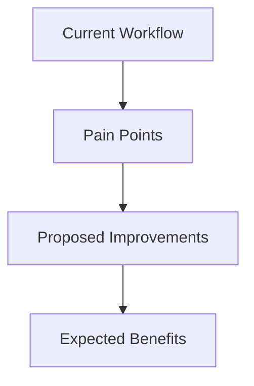

# Developer Feedback Template [TEMPLATE_DEV_FB] [PRIO: HIGH]

**Version: V1.0.0** **Date: 2026-01-12**

**Purpose:** Specialized template for developer feedback focused on framework architecture, component creation, and technical implementation.

---

## 📝 Developer Feedback Submission

```markdown
# Developer Feedback **[DEV_FEEDBACK_[YYYYMMDD]]** **[PRIO: MEDIUM/HIGH/CRITICAL]**

**Version: V1.0.0** **Date: [YYYY-MM-DD]**

**Stakeholder Type:** Developer/Integrator
**Developer Role:** [Component Creator/Tool Developer/Integrator/Architect]
**Experience Level:** [Beginner/Intermediate/Advanced]
**Contact Information:** [Email/GitHub/Contact Method]

---

## 📋 Technical Feedback Details

### **Feedback Category**
- [ ] Framework Architecture
- [ ] Component Design Patterns
- [ ] Template Structure
- [ ] Convention Implementation
- [ ] Rule Enforcement
- [ ] Tool Development
- [ ] Integration Challenges
- [ ] Performance Issues
- [ ] Security Concerns
- [ ] Other: [Specify]

### **Affected Technical Component**
- **Component Type:** [Principle/Rule/Convention/Template/Tool/API]
- **Component Location:** [File path or repository URL]
- **Component Version:** [Version number]
- **Programming Language:** [If applicable]

---

## 🎯 Technical Assessment

### **Architecture Feedback**
[Provide feedback on framework architecture, design patterns, and structural elements]

### **Component-Specific Feedback**
[Detailed analysis of specific components with suggestions for improvement]

### **Integration Challenges**
[Describe any integration difficulties encountered]

### **Performance Analysis**
[Provide performance metrics, bottlenecks, or optimization suggestions]

---

## 🔍 Code Quality Assessment

### **Code Structure Rating**
| Aspect | Rating (1-5) | Comments |
|--------|--------------|----------|
| Modularity | [1-5] | [Comments] |
| Reusability | [1-5] | [Comments] |
| Maintainability | [1-5] | [Comments] |
| Documentation | [1-5] | [Comments] |
| Error Handling | [1-5] | [Comments] |
| Testing Coverage | [1-5] | [Comments] |

### **Design Pattern Assessment**
[Evaluate the effectiveness of current design patterns and suggest improvements]

### **API/Interface Feedback**
[Feedback on framework APIs, interfaces, and integration points]

---

## 📊 Technical Implementation Feedback

### **Development Workflow Analysis**


### **Tooling Feedback**
| Tool | Rating (1-5) | Improvement Suggestions |
|------|--------------|-------------------------|
| Template Generator | [1-5] | [Suggestions] |
| Validation Tools | [1-5] | [Suggestions] |
| Conversion Tools | [1-5] | [Suggestions] |
| Testing Framework | [1-5] | [Suggestions] |

### **Dependency Management**
[Feedback on framework dependencies and version management]

---

## 🎯 Framework Extension Feedback

### **Extension Points Analysis**
[Evaluate the effectiveness of current extension mechanisms]

### **New Component Proposals**
[Suggest new components that should be added to the framework]

### **Component Lifecycle Feedback**
[Feedback on component creation, maintenance, and deprecation processes]

---

## 🔗 Technical Debt Identification

### **Identified Technical Debt**
| Area | Description | Impact | Priority |
|------|-------------|--------|----------|
| [Area] | [Description] | [Impact] | [Priority] |
| [Area] | [Description] | [Impact] | [Priority] |

### **Refactoring Suggestions**
[Specific refactoring recommendations with expected benefits]

---

## 📝 Developer Experience Improvements

### **Onboarding Experience**
[Feedback on developer onboarding process and documentation]

### **Debugging Support**
[Suggestions for improving debugging and troubleshooting]

### **Error Messages and Logging**
[Feedback on error handling and logging mechanisms]

---

## 🎯 Success Metrics from Developer Perspective

**Technical Quality Metrics:**
1. **Code Coverage Target:** [Percentage]
2. **Performance Benchmarks:** [Specific metrics]
3. **Integration Success Rate:** [Percentage]
4. **Developer Productivity:** [Metrics]

**Measurement Methods:**
[Describe how technical success should be measured]

---

## 🔗 Related Development Resources

- **Related Principles:** [List technical principles]
- **Related Tools:** [List development tools]
- **Related Templates:** [List technical templates]
- **Related User Stories:** [Link to developer user stories]

---

## 📝 Additional Developer Context

### **Use Case Scenario**
[Describe your specific development use case]

### **Comparison with Other Frameworks**
[Compare with other technical frameworks you've worked with]

### **Willingness to Contribute**
- [ ] Would submit pull requests for improvements
- [ ] Would develop new components
- [ ] Would contribute to technical documentation
- [ ] Would participate in architectural reviews

---

**Framework:** MODEL_for_framework
**License:** EUPL v1.2
**Status:** [Draft/Submitted/In Review/Implemented]
**Related User Story:** [Link to developer/integrator user stories]

## Changelog

| Version | Date | Change Content | Stakeholders | Motivation |
|---------|------|---------|-------------|----------------------|
| V0.1.0 | 2026-01-24 | Initial creation | Framework Maintenance Team | Establish foundational structure |
