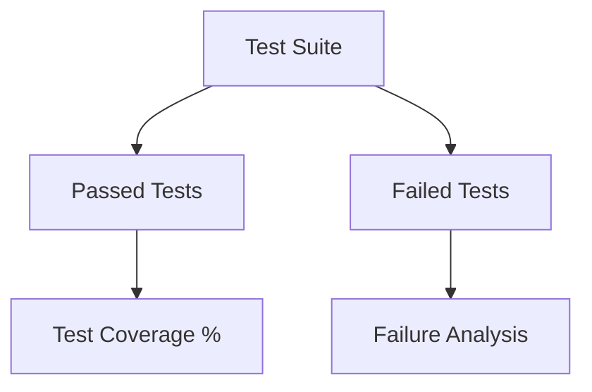
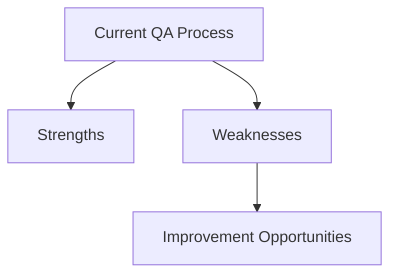

# Quality Feedback Template [TEMPLATE_QUALITY_FB] [PRIO: CRITICAL]

**Version: V1.0.0** **Date: 2026-01-12**

**Purpose:** Specialized template for quality assurance feedback focused on framework validation, compliance, and maintenance.

---

## 📝 Quality Feedback Submission

```markdown
# Quality Feedback **[QUALITY_FEEDBACK_[YYYYMMDD]]** **[PRIO: HIGH/CRITICAL]**

**Version: V1.0.0** **Date: [YYYY-MM-DD]**

**Stakeholder Type:** [Assurer/Maintainer/Quality Engineer]
**Quality Role:** [Validator/Compliance Officer/Tester/Maintainer]
**Experience Level:** [Beginner/Intermediate/Advanced]
**Contact Information:** [Email/Contact Method]

---

## 📋 Quality Assessment Details

### **Feedback Category**
- [ ] Compliance Validation
- [ ] Principle Adherence
- [ ] Rule Enforcement
- [ ] Convention Compliance
- [ ] Template Consistency
- [ ] Cross-Reference Integrity
- [ ] Documentation Accuracy
- [ ] Security Assessment
- [ ] Performance Validation
- [ ] Other: [Specify]

### **Affected Quality Aspect**
- **Component Type:** [Principle/Rule/Convention/Template/Tool/Process]
- **Component Location:** [File path or URL]
- **Component Version:** [Version number]
- **Quality Standard:** [Reference specific standard]

---

## 🎯 Compliance Assessment

### **Principle Compliance Review**
| Principle | Compliance Level (1-5) | Issues Found | Recommendations |
|-----------|------------------------|--------------|----------------|
| Human Sovereignty | [1-5] | [Issues] | [Recommendations] |
| Transparency | [1-5] | [Issues] | [Recommendations] |
| Proportionality | [1-5] | [Issues] | [Recommendations] |
| Accountability | [1-5] | [Issues] | [Recommendations] |
| Iterative Validation | [1-5] | [Issues] | [Recommendations] |
| Context Preservation | [1-5] | [Issues] | [Recommendations] |

### **Rule Enforcement Analysis**
[Evaluate effectiveness of rule enforcement mechanisms]

### **Convention Compliance Audit**
[Assess adherence to established conventions]

---

## 🔍 Quality Metrics and Validation

### **Quality Metrics Assessment**
| Metric | Current Value | Target Value | Gap Analysis |
|--------|---------------|--------------|--------------|
| Documentation Completeness | [%] | [%] | [Analysis] |
| Cross-Reference Integrity | [%] | [%] | [Analysis] |
| Template Consistency | [%] | [%] | [Analysis] |
| Principle Coverage | [%] | [%] | [Analysis] |
| Rule Compliance | [%] | [%] | [Analysis] |

### **Validation Test Results**


### **Test Coverage Analysis**
[Detailed analysis of testing coverage and gaps]

---

## 📊 Quality Improvement Recommendations

### **Critical Quality Issues**
| Issue ID | Description | Severity | Impact | Resolution Priority |
|----------|-------------|----------|--------|---------------------|
| [ID] | [Description] | [High/Medium/Low] | [Impact] | [Priority] |
| [ID] | [Description] | [High/Medium/Low] | [Impact] | [Priority] |

### **Quality Process Improvements**
[Recommendations for improving quality assurance processes]

### **Validation Framework Enhancements**
[Suggestions for enhancing validation mechanisms]

---

## 🎯 Maintenance and Sustainability Feedback

### **Maintenance Challenges**
[Identify challenges in framework maintenance]

### **Sustainability Assessment**
[Evaluate long-term sustainability of current approaches]

### **Deprecation Strategy Feedback**
[Feedback on component deprecation and versioning]

---

## 🔗 Quality Documentation Feedback

### **Quality Documentation Assessment**
| Documentation Type | Completeness (1-5) | Accuracy (1-5) | Improvement Suggestions |
|--------------------|--------------------|----------------|-------------------------|
| Principle Documents | [1-5] | [1-5] | [Suggestions] |
| Rule Documents | [1-5] | [1-5] | [Suggestions] |
| Convention Documents | [1-5] | [1-5] | [Suggestions] |
| Template Documents | [1-5] | [1-5] | [Suggestions] |
| Process Documents | [1-5] | [1-5] | [Suggestions] |

### **Missing Quality Documentation**
[Identify gaps in quality-related documentation]

---

## 📝 Quality Assurance Process Feedback

### **Current QA Process Analysis**


### **QA Tooling Feedback**
[Assessment of current QA tools and suggestions for improvement]

### **Automation Opportunities**
[Identify areas where QA processes could be automated]

---

## 🎯 Success Metrics from Quality Perspective

**Quality Success Criteria:**
1. **Compliance Target:** [Percentage] adherence to principles
2. **Validation Coverage:** [Percentage] of components validated
3. **Issue Resolution Time:** [Timeframe] for critical issues
4. **Documentation Accuracy:** [Percentage] accuracy rate

**Measurement Methods:**
[Describe quality measurement methodologies]

---

## 🔗 Related Quality Resources

- **Related Principles:** [Quality Assurance Principle links]
- **Related Validation Tools:** [List validation tools]
- **Related Testing Frameworks:** [List testing resources]
- **Related User Stories:** [Link to assurer/maintainer user stories]

---

## 📝 Additional Quality Context

### **Quality Use Case Scenario**
[Describe specific quality assurance scenarios]

### **Comparison with Quality Standards**
[Compare with industry quality standards]

### **Willingness to Contribute to Quality**
- [ ] Would develop validation tools
- [ ] Would create quality test cases
- [ ] Would contribute to quality documentation
- [ ] Would participate in quality reviews

---

**Framework:** MODEL_for_framework
**License:** EUPL v1.2
**Status:** [Draft/Submitted/In Review/Implemented]
**Related User Story:** [Link to assurer/maintainer user stories]
**Quality Impact:** [High/Medium/Low]