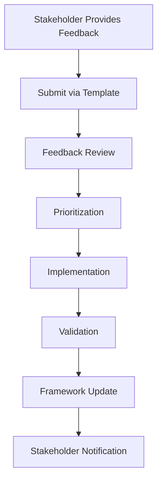
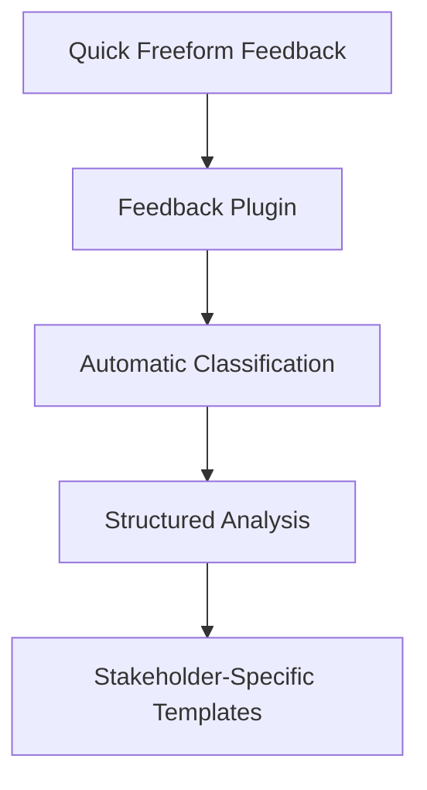

# Feedback System **[FEEDBACK_SYSTEM]** **[PRIO: HIGH]**

**Version: V2.0.0** **Date: 2026-01-12**

**Purpose:** Comprehensive feedback mechanism for all stakeholders to provide structured input, suggestions, and evaluations for continuous framework improvement.

---

## 📋 Feedback System Overview

The feedback system enables all stakeholders to contribute to framework evolution through structured feedback mechanisms. This system supports the **Continuous Learning** principle and ensures stakeholder voices are heard.

### **Feedback Types**
| Type | Purpose | Target Audience |
|------|---------|-----------------|
| **User Feedback** | Framework usability and effectiveness | Users, Implementers |
| **Developer Feedback** | Component creation and integration | Developers, Integrators |
| **Quality Feedback** | Framework validation and assurance | Assurers, Maintainers |
| **General Feedback** | Overall framework suggestions | All Stakeholders |
| **Bug Reports** | Issue identification and resolution | All Stakeholders |
| **Feature Requests** | New functionality proposals | All Stakeholders |

---

## 🗂️ Feedback Structure

```
40_feedback/
├── 05_quick_feedback_example.md      # Super minimal freeform feedback example
├── 10_plugin_fb_OT_detailed/         # Comprehensive feedback plugin system
│   ├── 10_plugin_for_fb_OT_detailed.md # Main plugin documentation
│   ├── 70_feedback_process/          # Feedback handling workflows
│   └── 90_templates/                 # All feedback templates
├── 10_user_feedback/                # User experience feedback
├── 20_developer_feedback/           # Developer and integrator feedback
├── 30_quality_feedback/             # Assurer and maintainer feedback
├── 40_general_feedback/             # General framework feedback
├── 50_bug_reports/                  # Issue tracking
└── 60_feature_requests/             # New feature proposals
```

---

## 🔗 Related Framework Elements

- **Continuous Learning Principle**: `../MODEL_for_STKHLD_AI_COLLAB/30_principle/12_principle_continuous_learning.md`
- **Quality Assurance Principle**: `../MODEL_for_STKHLD_AI_COLLAB/30_principle/09_principle_quality_assurance.md`
- **Iterative Validation Principle**: `../MODEL_for_STKHLD_AI_COLLAB/30_principle/05_principle_iterative_validation.md`
- **User Stories**: `../00_overview/30_user_story/`

---

## 📝 Feedback Process



---

## 🎯 Feedback Goals

1. **Continuous Improvement**: Enable ongoing framework enhancement
2. **Stakeholder Engagement**: Ensure all voices are heard
3. **Quality Assurance**: Maintain high standards through feedback
4. **Transparency**: Clear feedback tracking and resolution
5. **Collaboration**: Foster community participation

---

## 📊 Success Metrics

- **Feedback Response Time**: ≤ 72 hours for acknowledgment
- **Resolution Rate**: ≥ 80% of actionable feedback implemented
- **Stakeholder Satisfaction**: ≥ 4/5 rating for feedback process
- **Framework Evolution**: Measurable improvements from feedback

---

## 🚀 Quick Feedback Option

For those who want to provide feedback without using structured templates, we offer a **super minimal freeform feedback example**:

📝 **[Quick Feedback Example](05_quick_feedback_example.md)** - Simple template for fast, unstructured feedback

```markdown
# Quick Feedback **[QUICK_[YYYYMMDD]]**

**Date:** [YYYY-MM-DD]
**From:** [Your Name/Contact - Optional]

---

## 🎯 Your Feedback

[Write your feedback here - completely freeform!]

This can be:
- A quick suggestion
- A bug report
- A feature idea
- General praise or criticism
- Anything you want to share!

---
```

**Perfect for:**
- Quick suggestions and ideas
- Rapid bug reports
- Spontaneous feedback
- Users who prefer simplicity
- Fast communication

Just copy the template, fill in your thoughts, and save it in the appropriate feedback directory!

---

## 🔧 Feedback Plugin System

The **Feedback Plugin System** provides a comprehensive feedback collection and processing framework:

🔧 **[Feedback Plugin](10_plugin_fb_OT_detailed/10_plugin_for_fb_OT_detailed.md)** - Complete feedback processing system



**Key Features:**
- **Natural Progression**: Starts with minimal freeform input
- **Automatic Classification**: Intelligent routing to appropriate templates
- **Context Enhancement**: Adds structured analysis framework
- **Stakeholder Routing**: Directs feedback to relevant parties
- **Escalation Paths**: Handles minor to critical issues appropriately

**Plugin Components:**
- **Main Plugin**: `10_plugin_for_fb_OT_detailed.md`
- **Process Workflows**: `70_feedback_process/`
- **Template Library**: `90_templates/`

**Perfect for:**
- Framework maintainers processing user feedback
- Quality assurance teams validating submissions
- Development teams analyzing technical feedback
- Continuous improvement workflows
- Complex feedback that requires structured analysis

---

## 📋 Feedback Templates Collection

### **1. General Feedback Template**
**Location:** `10_plugin_fb_OT_detailed/90_templates/10_template_for_feedback_OT_detailed.md`
**Purpose:** Comprehensive framework suggestions
**Key Sections:** Impact assessment, evaluation criteria, success metrics

### **2. User Feedback Template**
**Location:** `10_plugin_fb_OT_detailed/90_templates/20_user_feedback_template.md`
**Purpose:** Detailed usability and user experience analysis
**Key Sections:** Usability ratings, documentation feedback, learning curve assessment

### **3. Developer Feedback Template**
**Location:** `10_plugin_fb_OT_detailed/90_templates/30_developer_feedback_template.md`
**Purpose:** Technical implementation and architecture analysis
**Key Sections:** Code quality assessment, tooling feedback, integration challenges

### **4. Quality Feedback Template**
**Location:** `10_plugin_fb_OT_detailed/90_templates/40_quality_feedback_template.md`
**Purpose:** Compliance validation and quality assurance
**Key Sections:** Principle compliance review, validation metrics, process improvements

---

**Framework:** MODEL_for_framework
**License:** EUPL v1.2
**Status:** ACTIVE
**Version:** V2.0.0

## Changelog

| Version | Date | Change Content | Stakeholders | Motivation |
|---------|------|---------|-------------|----------------------|
| V0.1.0 | 2026-01-24 | Initial creation | Framework Maintenance Team | Establish foundational structure |
