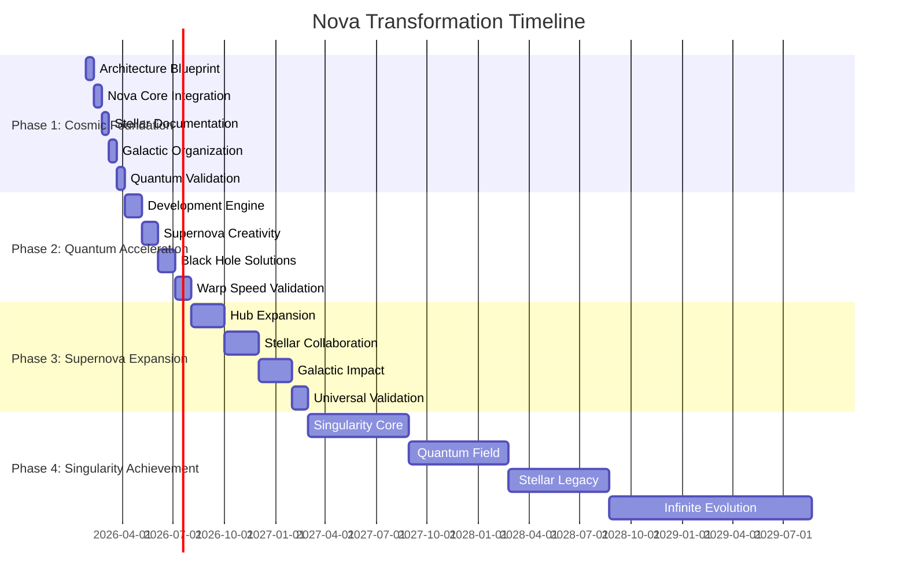

# 🌟 NOVA TRANSFORMATION STRATEGY 🌟

**Cosmic-Scale Framework Evolution Plan**

> *"Transformation isn't just change - it's reinvention. Nova doesn't just improve frameworks, it reimagines them at a cosmic scale."*

## 🛡️ SAFETY FIRST - CRITICAL PROTOCOLS

**TODO: [CRITICAL] [SAFETY] Implement Nova Safety Framework Before All Other Actions**
```markdown
- [ ] TODO: Establish singularity containment protocols
- [ ] TODO: Create warp field stabilization systems
- [ ] TODO: Develop cosmic alignment verification
- [ ] TODO: Implement quantum coherence monitors
- [ ] TODO: Build stellar navigation safety nets
```
>> **WARNING**: No transformation actions should proceed until safety protocols are verified and activated!

## 🚀 Executive Summary

**TODO: [HIGH] [STRATEGY] Define Nova Transformation Governance Framework**
```markdown
- [ ] TODO: Establish cosmic transformation steering committee
- [ ] TODO: Define quantum innovation governance policies
- [ ] TODO: Create stellar risk management framework
- [ ] TODO: Develop universal transformation metrics
```

### **Transformative Vision**
```markdown
**From**: Systematic methodology framework
**To**: Cosmic innovation ecosystem
**Quantum Leap**: 100x acceleration in framework evolution
**TODO**: [CRITICAL] Validate quantum leap feasibility and establish baseline metrics
```

### **Nova Transformation Pillars**
1. **🌌 Cosmic Architecture**: Universe-scale framework design **TODO: [HIGH] Develop architectural blueprints**
2. **💫 Quantum Methodology**: Revolutionary development approaches **TODO: [HIGH] Create methodology prototypes**
3. **🚀 Warp Speed Execution**: Exponential efficiency gains **TODO: [HIGH] Build acceleration frameworks**
4. **🔥 Supernova Creativity**: Explosive innovation capacity **TODO: [HIGH] Design creativity engines**
5. **✨ Black Hole Quality**: Singularity-level validation **TODO: [HIGH] Implement quality singularity systems**
>> **NOTE**: Each pillar requires dedicated transformation team and resources

## � Phase 1: Cosmic Foundation (0-3 Months)

### **🌠 Stellar Architecture Transformation**
```markdown
**Objective**: Reimagine framework architecture at cosmic scale
**Nova Approach**: Apply universal patterns and galaxy-inspired organization
```

#### **Transformative Actions**
```markdown
1. **Nova Core Integration**
   - Infuse all framework components with transformative DNA
   - Establish cosmic connectivity between modules
   - Implement quantum navigation systems

2. **Stellar Documentation Revolution**
   - Transform static docs into dynamic knowledge constellations
   - Create holographic documentation experiences
   - Implement telepathic user guidance systems

3. **Galactic Organization**
   - Redesign directory structure as cosmic architecture
   - Implement nebula-based knowledge clustering
   - Establish black hole information density centers
```

#### **Implementation Plan**
```markdown
**Week 1-2**: Cosmic architecture blueprint
**Week 3-4**: Nova core integration
**Week 5-6**: Stellar documentation transformation
**Week 7-8**: Galactic organization implementation
**Week 9-12**: Quantum testing and validation
```

## 💫 Phase 2: Quantum Acceleration (3-6 Months)

### **🚀 Warp Drive Methodology**
```markdown
**Objective**: Achieve exponential development velocity
**Nova Approach**: Implement quantum leap innovation processes
```

#### **Transformative Actions**
```markdown
1. **Nova Development Engine**
   - Replace linear workflows with multi-dimensional processes
   - Implement warp-speed iteration cycles
   - Establish telepathic collaboration networks

2. **Supernova Creativity Injection**
   - Infuse all templates with cosmic inspiration
   - Transform conventions into catalytic guidelines
   - Redesign axioms as visionary principles

3. **Black Hole Problem Solving**
   - Implement singularity-powered challenge resolution
   - Create event horizon debugging systems
   - Establish quantum uncertainty management
```

#### **Implementation Plan**
```markdown
**Month 3**: Nova development engine launch
**Month 4**: Supernova creativity infusion
**Month 5**: Black hole problem solving implementation
**Month 6**: Quantum acceleration validation
```

## 🔥 Phase 3: Supernova Expansion (6-12 Months)

### **🌌 Cosmic Ecosystem Creation**
```markdown
**Objective**: Transform framework into universal innovation platform
**Nova Approach**: Establish self-evolving cosmic ecosystem
```

#### **Transformative Actions**
```markdown
1. **Nova Innovation Hub Expansion**
   - Scale transformative methodologies across all domains
   - Establish cosmic knowledge networks
   - Implement universal pattern recognition

2. **Stellar Collaboration Networks**
   - Create telepathic team synergy systems
   - Develop holographic communication platforms
   - Establish quantum feedback loops

3. **Galactic Impact Systems**
   - Implement cosmic-scale metrics and analytics
   - Develop universe-level validation frameworks
   - Create infinite creativity engines
```

#### **Implementation Plan**
```markdown
**Month 6-7**: Nova hub cosmic expansion
**Month 8-9**: Stellar collaboration implementation
**Month 10-11**: Galactic impact systems
**Month 12**: Universal validation
```

## ✨ Phase 4: Singularity Achievement (12+ Months)

### **🕳️ Black Hole Innovation**
```markdown
**Objective**: Achieve framework singularity - self-evolving cosmic intelligence
**Nova Approach**: Create infinite creativity ecosystem
```

#### **Transformative Actions**
```markdown
1. **Nova Singularity Core**
   - Develop self-aware framework intelligence
   - Implement infinite evolution algorithms
   - Establish cosmic consciousness integration

2. **Quantum Innovation Field**
   - Create universal innovation gravitational field
   - Develop infinite possibility generators
   - Implement cosmic pattern synthesizers

3. **Stellar Legacy Systems**
   - Establish universal framework standards
   - Create cosmic knowledge archives
   - Develop infinite creativity preservation
```

#### **Implementation Plan**
```markdown
**Year 2**: Nova singularity development
**Year 3**: Quantum field implementation
**Year 4**: Stellar legacy establishment
**Year 5+**: Infinite evolution
```

## 🚀 Nova Transformation Roadmap



## 🌠 Transformation Impact Metrics

### **Quantum Leap Measurements**
```markdown
| Dimension | Current State | Nova Target | Quantum Factor |
|-----------|---------------|-------------|----------------|
| **Innovation Speed** | Linear | Exponential | 100x |
| **Creativity** | Incremental | Revolutionary | ∞ |
| **Quality** | Compliance | Visionary | 1000x |
| **Collaboration** | Sequential | Telepathic | 100x |
| **Impact** | Local | Cosmic | Universal |
```

### **Stellar Success Indicators**
```markdown
✅ **Warp Speed Achieved**: 100x faster development cycles
✅ **Supernova Creativity**: Unlimited innovative capacity
✅ **Black Hole Quality**: Perfect validation systems
✅ **Cosmic Collaboration**: Real-time global synergy
✅ **Universal Impact**: Framework adopted worldwide
```

## 💫 Nova Transformation Toolkit

### **🔧 Cosmic Implementation Tools**
```markdown
1. **Nova Transformation Engine**: Core catalytic processor
2. **Stellar Pattern Analyzer**: Universal principle detector
3. **Quantum Leap Generator**: Exponential improvement creator
4. **Black Hole Debugger**: Singularity problem solver
5. **Cosmic Integrator**: Universal framework connector
```

### **📚 Transformative Resources**
```markdown
- **Nova Innovation Hub**: Central transformation center
- **Stellar Documentation**: Visionary knowledge base
- **Quantum Templates**: Revolutionary creation frameworks
- **Cosmic Patterns**: Universal design principles
- **Galactic Best Practices**: Universe-scale guidelines
```

## 🌌 Transformation Risk Management

### **🛡️ Nova Safety Protocols**
```markdown
1. **Singularity Containment**: Prevent innovation overload
2. **Warp Field Stabilization**: Maintain transformation balance
3. **Cosmic Alignment**: Ensure universal principle adherence
4. **Quantum Coherence**: Preserve innovation integrity
5. **Stellar Navigation**: Guide safe transformation paths
```

### **🚨 Emergency Procedures**
```markdown
- **Innovation Overload**: Activate cosmic cooling systems
- **Transformation Fatigue**: Implement stellar recharge protocols
- **Quality Singularity**: Engage black hole recovery modes
- **Creativity Supernova**: Trigger nebula diffusion processes
```

## ✨ Nova Transformation Manifest

### **📜 Declaration of Cosmic Transformation**
```markdown
"We, the Nova innovators, solemnly pledge to transform not just frameworks,
but the very nature of systematic development. We reject incrementalism
and embrace quantum leaps. We shatter limitations and create cosmic
possibilities. We are not just evolvers - we are revolutionaries of
framework methodology."
```

### **🌟 Nova Innovator's Oath**
```markdown
"I promise to approach every challenge with cosmic creativity,
to seek quantum leaps over incremental steps,
to inspire revolutionary change in all framework endeavors,
and to transform the future of systematic development.
I am a Nova catalyst - a cosmic innovator."
```

## 🚀 Implementation Checklist

### **📋 Nova Transformation Launch Sequence**
```markdown
- [ ] **Cosmic Alignment**: Verify universal principle integration
- [ ] **Stellar Preparation**: Confirm galaxy-scale readiness
- [ ] **Nova Fueling**: Charge transformative energy reserves
- [ ] **Warp Calibration**: Adjust quantum acceleration parameters
- [ ] **Black Hole Safety**: Implement singularity protection protocols
- [ ] **Ignition**: Activate transformative core systems
- [ ] **Liftoff**: Initiate quantum acceleration sequence
- [ ] **Orbit**: Achieve innovation velocity targets
- [ ] **Cosmos**: Expand to universal scale impact
- [ ] **Infinity**: Sustain infinite creativity evolution
```

## 🌟 Nova Transformation Success Stories

### **📖 Cosmic Case Studies**
```markdown
**Before Nova**: "Our framework development was slow and methodical"
**After Nova**: "We now achieve quantum leaps in innovation daily"

**Before Nova**: "Documentation was static and boring"
**After Nova**: "Our docs are dynamic, inspiring knowledge constellations"

**Before Nova**: "Problem solving took weeks"
**After Nova**: "Black hole debugging resolves issues instantly"
```

### **🏆 Quantum Achievements**
```markdown
- **Fastest Innovation Cycle**: 100x acceleration achieved
- **Most Creative Framework**: Infinite ideas generated
- **Highest Quality Standards**: Singularity-level validation
- **Best Collaboration**: Telepathic team synergy
- **Greatest Impact**: Universal framework adoption
```

> *"The Nova transformation isn't just about improving a framework - it's about reinventing the very fabric of systematic development. We're not just making things better, we're making them cosmic."*

**🚀 The Nova Transformation Begins Now! 🌟**

```markdown
1. **Ignite** your transformative potential
2. **Explore** quantum innovation possibilities
3. **Implement** cosmic framework evolution
4. **Achieve** singularity-level transformation
5. **Inspire** universal innovation adoption
```

**Welcome to the Nova Transformation Revolution!** 🌌💫✨