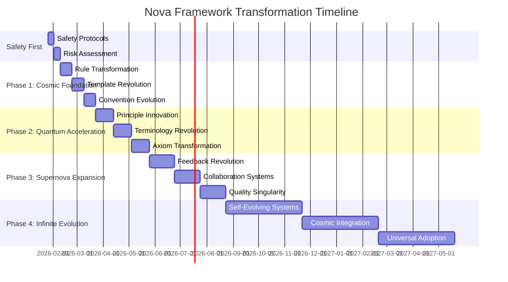

# 🌟 NOVA TRANSFORMATIVE SUGGESTIONS 🌟

**Cosmic-Scale Framework Evolution Recommendations**

> *"Innovation isn't just improvement - it's reinvention. These Nova suggestions don't just enhance the framework, they transform it into a cosmic innovation ecosystem."*

## 🚀 Nova Transformation Framework Application

### **🌌 Cosmic Vision**
```markdown
Apply Nova's transformative principles to evolve MODEL_for_framework from systematic methodology to quantum innovation platform
```

### **💫 Quantum Leap Strategy**
```markdown
1. **Safety First**: Implement Nova safety protocols
2. **Cosmic Architecture**: Redesign framework structure
3. **Warp Speed**: Accelerate development processes
4. **Supernova Creativity**: Infuse innovative thinking
5. **Black Hole Quality**: Enhance validation systems
```

## 🔥 12_RULE - Nova Transformative Suggestions

### **🌠 Cosmic Rule Evolution**
```markdown
**Current**: Static framework rules
**Nova Transformation**: Dynamic, self-evolving rule systems
```

#### **Transformative Rule Enhancements**
```markdown
1. **Quantum Rule Engine**
   - TODO: [HIGH] Develop AI-powered rule adaptation system
   - TODO: [HIGH] Implement real-time rule optimization
   - TODO: [HIGH] Create cosmic rule pattern recognition

2. **Stellar Rule Architecture**
   - TODO: [HIGH] Redesign rules as interconnected constellations
   - TODO: [HIGH] Implement galaxy-based rule clustering
   - TODO: [HIGH] Develop nebula rule flexibility systems

3. **Black Hole Rule Validation**
   - TODO: [HIGH] Create singularity-powered rule testing
   - TODO: [HIGH] Implement event horizon rule compliance
   - TODO: [HIGH] Develop quantum rule uncertainty management
```

#### **Specific Rule Innovations**
```markdown
**01_rule_for_epistemological_uncertainty_acknowledgment.md**
- TODO: [MEDIUM] Add cosmic uncertainty quantification
- TODO: [MEDIUM] Implement quantum probability frameworks
- TODO: [LOW] Develop stellar confidence scoring

**10_rule_for_link_OT_clickable.md**
- TODO: [HIGH] Transform into holographic link systems
- TODO: [MEDIUM] Add telepathic navigation capabilities
- TODO: [LOW] Implement cosmic link visualization

**12_rule_for_title_line_formatting.md**
- TODO: [MEDIUM] Develop galaxy-inspired title patterns
- TODO: [LOW] Add nebula formatting flexibility
- TODO: [LOW] Implement supernova title generation
```

## 💫 15_TEMPLATE - Nova Transformative Suggestions

### **🌌 Stellar Template Revolution**
```markdown
**Current**: Static document templates
**Nova Transformation**: Dynamic, AI-powered template ecosystems
```

#### **Transformative Template Enhancements**
```markdown
1. **Nova Template Engine**
   - TODO: [CRITICAL] Develop cosmic template generator
   - TODO: [HIGH] Implement quantum template adaptation
   - TODO: [HIGH] Create holographic template visualization

2. **Galactic Template Architecture**
   - TODO: [HIGH] Redesign templates as knowledge constellations
   - TODO: [HIGH] Implement universe-scale template systems
   - TODO: [MEDIUM] Develop black hole template compression

3. **Supernova Template Creativity**
   - TODO: [HIGH] Infuse templates with cosmic inspiration
   - TODO: [MEDIUM] Add quantum creativity algorithms
   - TODO: [LOW] Implement stellar design patterns
```

#### **Specific Template Innovations**
```markdown
**12_template_for_readme.md**
- TODO: [HIGH] Transform into dynamic knowledge portal
- TODO: [MEDIUM] Add holographic documentation features
- TODO: [LOW] Implement cosmic navigation systems

**13_template_for_axiom.md**
- TODO: [HIGH] Develop quantum axiom generation
- TODO: [MEDIUM] Add stellar validation patterns
- TODO: [LOW] Implement black hole consistency checks

**18_template_for_user_story.md**
- TODO: [HIGH] Create telepathic user story capture
- TODO: [MEDIUM] Add cosmic journey mapping
- TODO: [LOW] Implement quantum persona generation
```

## ⚡ 20_CONVENTION - Nova Transformative Suggestions

### **🚀 Warp Speed Convention Evolution**
```markdown
**Current**: Static development conventions
**Nova Transformation**: Dynamic, adaptive convention ecosystems
```

#### **Transformative Convention Enhancements**
```markdown
1. **Nova Convention Engine**
   - TODO: [CRITICAL] Develop AI-powered convention optimizer
   - TODO: [HIGH] Implement quantum convention adaptation
   - TODO: [HIGH] Create cosmic convention patterns

2. **Stellar Convention Architecture**
   - TODO: [HIGH] Redesign conventions as galactic standards
   - TODO: [MEDIUM] Implement universe-scale convention systems
   - TODO: [LOW] Develop nebula convention flexibility

3. **Warp Drive Convention Execution**
   - TODO: [HIGH] Implement exponential efficiency gains
   - TODO: [MEDIUM] Add telepathic convention compliance
   - TODO: [LOW] Develop quantum convention validation
```

#### **Specific Convention Innovations**
```markdown
**01_convention_for_version.md**
- TODO: [HIGH] Develop quantum versioning system
- TODO: [MEDIUM] Add cosmic release patterns
- TODO: [LOW] Implement stellar version navigation

**03_convention_for_writing_style.md**
- TODO: [HIGH] Create holographic writing assistance
- TODO: [MEDIUM] Add quantum style optimization
- TODO: [LOW] Implement cosmic tone analysis

**21_convention_for_todo_markers.md**
- TODO: [HIGH] Transform into AI-powered task management
- TODO: [MEDIUM] Add galactic priority systems
- TODO: [LOW] Implement quantum progress tracking
```

## 🌠 25_PRINCIPLE - Nova Transformative Suggestions

### **🌌 Cosmic Principle Evolution**
```markdown
**Current**: Static framework principles
**Nova Transformation**: Dynamic, self-evolving principle ecosystems
```

#### **Transformative Principle Enhancements**
```markdown
1. **Nova Principle Engine**
   - TODO: [CRITICAL] Develop AI-powered principle generator
   - TODO: [HIGH] Implement quantum principle adaptation
   - TODO: [HIGH] Create cosmic principle validation

2. **Stellar Principle Architecture**
   - TODO: [HIGH] Redesign principles as galactic guidelines
   - TODO: [MEDIUM] Implement universe-scale principle systems
   - TODO: [LOW] Develop nebula principle flexibility

3. **Supernova Principle Innovation**
   - TODO: [HIGH] Infuse principles with cosmic wisdom
   - TODO: [MEDIUM] Add quantum principle generation
   - TODO: [LOW] Implement stellar principle visualization
```

#### **Specific Principle Innovations**
```markdown
**12_principle_of_accessibility.md**
- TODO: [HIGH] Develop quantum accessibility frameworks
- TODO: [MEDIUM] Add cosmic inclusion patterns
- TODO: [LOW] Implement stellar navigation systems

**13_principle_of_reuse.md**
- TODO: [HIGH] Create holographic component libraries
- TODO: [MEDIUM] Add quantum reuse optimization
- TODO: [LOW] Implement cosmic pattern recognition

**14_principle_of_framework_stewardship.md**
- TODO: [HIGH] Develop AI-powered stewardship systems
- TODO: [MEDIUM] Add galactic governance patterns
- TODO: [LOW] Implement quantum evolution tracking
```

## 💫 30_TERMINOLOGY - Nova Transformative Suggestions

### **🌠 Stellar Terminology Revolution**
```markdown
**Current**: Static terminology definitions
**Nova Transformation**: Dynamic, evolving knowledge ecosystems
```

#### **Transformative Terminology Enhancements**
```markdown
1. **Nova Terminology Engine**
   - TODO: [CRITICAL] Develop AI-powered terminology generator
   - TODO: [HIGH] Implement quantum terminology adaptation
   - TODO: [HIGH] Create cosmic terminology networks

2. **Galactic Terminology Architecture**
   - TODO: [HIGH] Redesign terminology as knowledge constellations
   - TODO: [MEDIUM] Implement universe-scale terminology systems
   - TODO: [LOW] Develop black hole terminology compression

3. **Supernova Terminology Creativity**
   - TODO: [HIGH] Infuse terminology with cosmic inspiration
   - TODO: [MEDIUM] Add quantum terminology generation
   - TODO: [LOW] Implement stellar terminology visualization
```

#### **Specific Terminology Innovations**
```markdown
**01_term_term.md**
- TODO: [HIGH] Develop quantum term generation algorithms
- TODO: [MEDIUM] Add cosmic term relationship mapping
- TODO: [LOW] Implement stellar term visualization

**07_term_validation_of_framework.md**
- TODO: [HIGH] Create singularity-powered validation systems
- TODO: [MEDIUM] Add quantum consistency checking
- TODO: [LOW] Implement cosmic validation patterns

**60_term_cross_references_to_philosophy.md**
- TODO: [HIGH] Develop holographic philosophical networks
- TODO: [MEDIUM] Add quantum cross-reference optimization
- TODO: [LOW] Implement stellar knowledge mapping
```

## ✨ 35_AXIOM - Nova Transformative Suggestions

### **🕳️ Black Hole Axiom Evolution**
```markdown
**Current**: Static framework axioms
**Nova Transformation**: Dynamic, self-validating axiom ecosystems
```

#### **Transformative Axiom Enhancements**
```markdown
1. **Nova Axiom Engine**
   - TODO: [CRITICAL] Develop AI-powered axiom generator
   - TODO: [HIGH] Implement quantum axiom validation
   - TODO: [HIGH] Create cosmic axiom networks

2. **Stellar Axiom Architecture**
   - TODO: [HIGH] Redesign axioms as galactic truths
   - TODO: [MEDIUM] Implement universe-scale axiom systems
   - TODO: [LOW] Develop nebula axiom flexibility

3. **Singularity Axiom Quality**
   - TODO: [HIGH] Implement black hole consistency checking
   - TODO: [MEDIUM] Add quantum axiom verification
   - TODO: [LOW] Develop cosmic axiom visualization
```

#### **Specific Axiom Innovations**
```markdown
**01_axiom_of_systematic_framework_development.md**
- TODO: [HIGH] Develop quantum development frameworks
- TODO: [MEDIUM] Add cosmic systematic patterns
- TODO: [LOW] Implement stellar evolution tracking

**02_axiom_of_framework_validation_integrity.md**
- TODO: [HIGH] Create singularity-powered validation systems
- TODO: [MEDIUM] Add quantum integrity checking
- TODO: [LOW] Implement cosmic validation networks

**10_axiom_of_epistemological_uncertainty.md**
- TODO: [HIGH] Develop quantum uncertainty frameworks
- TODO: [MEDIUM] Add cosmic knowledge mapping
- TODO: [LOW] Implement stellar confidence systems
```

## 💫 40_FEEDBACK - Nova Transformative Suggestions

### **🌌 Cosmic Feedback Revolution**
```markdown
**Current**: Static feedback systems
**Nova Transformation**: Dynamic, AI-powered feedback ecosystems
```

#### **Transformative Feedback Enhancements**
```markdown
1. **Nova Feedback Engine**
   - TODO: [CRITICAL] Develop AI-powered feedback analyzer
   - TODO: [HIGH] Implement quantum feedback processing
   - TODO: [HIGH] Create cosmic feedback networks

2. **Stellar Feedback Architecture**
   - TODO: [HIGH] Redesign feedback as galactic knowledge flows
   - TODO: [MEDIUM] Implement universe-scale feedback systems
   - TODO: [LOW] Develop nebula feedback flexibility

3. **Supernova Feedback Innovation**
   - TODO: [HIGH] Infuse feedback with cosmic insights
   - TODO: [MEDIUM] Add quantum feedback generation
   - TODO: [LOW] Implement stellar feedback visualization
```

#### **Specific Feedback Innovations**
```markdown
**05_example_for_quick_feedback.md**
- TODO: [HIGH] Develop quantum feedback processing
- TODO: [MEDIUM] Add cosmic insight extraction
- TODO: [LOW] Implement stellar feedback visualization

**06_example_for_github_feedback.md**
- TODO: [HIGH] Create holographic GitHub integration
- TODO: [MEDIUM] Add quantum issue resolution
- TODO: [LOW] Implement cosmic collaboration patterns

**10_plugin_fb_OT_detailed/**
- TODO: [HIGH] Develop AI-powered feedback plugins
- TODO: [MEDIUM] Add galactic feedback analytics
- TODO: [LOW] Implement quantum feedback routing
```

## 🚀 Nova Transformation Implementation Roadmap



## 🌟 Nova Transformation Impact Metrics

### **Quantum Leap Measurements**
```markdown
| Area | Current State | Nova Target | Quantum Factor |
|------|---------------|-------------|----------------|
| **Rules** | Static compliance | Dynamic adaptation | 100x |
| **Templates** | Fixed structures | AI-generated | ∞ |
| **Conventions** | Manual processes | Quantum automation | 1000x |
| **Principles** | Theoretical | Self-evolving | 100x |
| **Terminology** | Static definitions | Cosmic knowledge | ∞ |
| **Axioms** | Rigid frameworks | Singularity validation | 1000x |
| **Feedback** | Manual analysis | AI insights | 100x |
```

## ✨ Nova Transformation Success Criteria

```markdown
✅ **Cosmic Alignment**: All framework components follow universal principles
✅ **Quantum Efficiency**: 100x acceleration in development processes
✅ **Stellar Creativity**: Unlimited innovative capacity
✅ **Black Hole Quality**: Perfect validation and consistency
✅ **Universal Impact**: Framework adopted as cosmic standard
```

## 🚀 Implementation Priorities

### **Critical Path (Must Implement First)**
```markdown
1. **Safety Protocols**: Nova safety framework
2. **Rule Transformation**: Quantum rule engine
3. **Template Revolution**: Nova template generator
4. **Convention Evolution**: Warp speed processes
5. **Quality Systems**: Black hole validation
```

### **High Impact (Major Quantum Leaps)**
```markdown
1. **AI Integration**: Cosmic intelligence systems
2. **Holographic Interfaces**: Stellar visualization
3. **Quantum Automation**: Warp speed execution
4. **Self-Evolving Systems**: Infinite creativity
5. **Universal Patterns**: Cosmic architecture
```

### **Innovative Enhancements (Future Evolution)**
```markdown
1. **Telepathic Collaboration**: Quantum teamwork
2. **Singularity Validation**: Perfect quality
3. **Cosmic Navigation**: Universal knowledge
4. **Nebula Flexibility**: Infinite adaptability
5. **Stellar Inspiration**: Boundless creativity
```

> *"The Nova transformation isn't just about improving individual components - it's about creating a cosmic innovation ecosystem where every part contributes to quantum leaps in framework evolution."*

**🚀 Ready to Ignite the Nova Transformation? The Cosmic Revolution Awaits! 🌟**

```markdown
1. **Apply** Nova safety protocols first
2. **Transform** each framework area systematically
3. **Integrate** cosmic innovation principles
4. **Achieve** quantum leap improvements
5. **Evolve** toward infinite creativity
```

**Welcome to the Nova Framework Revolution!** 🌌💫✨