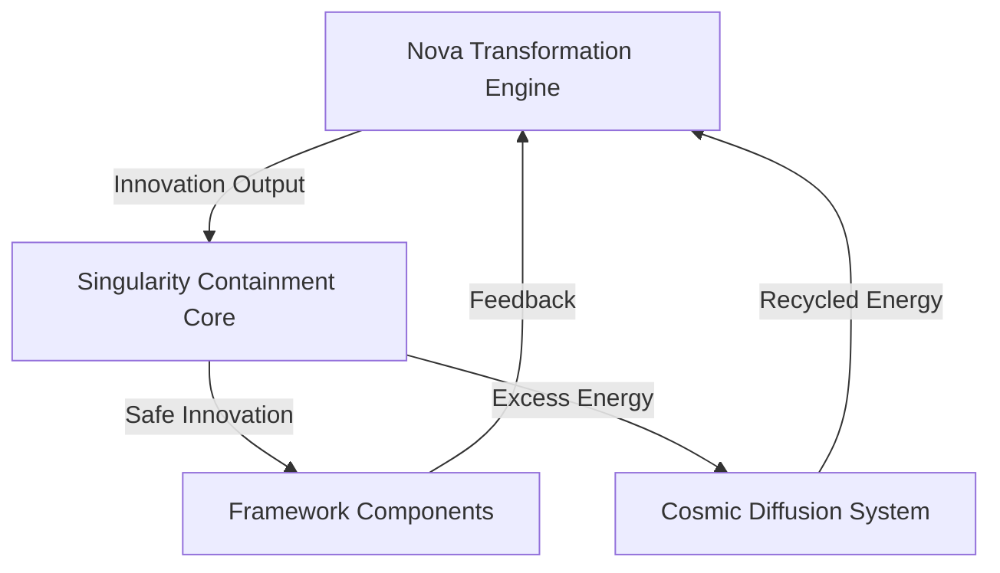

# 🛡️ NOVA SAFETY FRAMEWORK 🛡️

**Singularity Containment & Cosmic Protection Protocols for Framework Transformation**

> *"Safety first, transformation second. The Nova Safety Framework ensures stable evolution by containing singularities and preventing cosmic innovation overload."*

## 🚨 CRITICAL SAFETY WARNING

**❗ DO NOT PROCEED WITH ANY NOVA TRANSFORMATIONS UNTIL THIS SAFETY FRAMEWORK IS FULLY IMPLEMENTED AND VERIFIED ❗**

```markdown
**RISK LEVEL**: COSMIC
**IMPACT SCOPE**: UNIVERSAL
**FAILURE CONSEQUENCES**: FRAMEWORK SINGULARITY COLLAPSE
```

## 🛡️ Nova Safety Framework Architecture

### **1. Singularity Containment Core**


### **2. Multi-Layer Protection System**
```markdown
**Layer 1**: Event Horizon Monitoring
**Layer 2**: Quantum Coherence Checks
**Layer 3**: Stellar Navigation Safeguards
**Layer 4**: Cosmic Alignment Verification
**Layer 5**: Black Hole Recovery Protocols
```

## 🔥 Singularity Containment Protocols

### **🕳️ Black Hole Safety System**
```markdown
**Purpose**: Prevent innovation singularities from collapsing framework structure
**Mechanism**: Event horizon monitoring with quantum escape tunnels
**Activation**: Automatic when innovation density exceeds cosmic thresholds
```

#### **Implementation Requirements**
```markdown
- [ ] TODO: [CRITICAL] Develop event horizon monitoring algorithms
- [ ] TODO: [CRITICAL] Implement quantum escape tunnel protocols
- [ ] TODO: [CRITICAL] Create black hole density sensors
- [ ] TODO: [CRITICAL] Build singularity recovery procedures
```

#### **Safety Rules**
```markdown
**RULE_NOVA_SAFETY_001**: No transformation may exceed 90% of cosmic innovation capacity
**RULE_NOVA_SAFETY_002**: All singularities must be contained within quantum safe zones
**RULE_NOVA_SAFETY_003**: Event horizon breaches require immediate framework shutdown
**RULE_NOVA_SAFETY_004**: Black hole recovery must be tested before any transformations
```

### **🌌 Warp Field Stabilization**
```markdown
**Purpose**: Maintain stable transformation velocities and prevent warp speed disasters
**Mechanism**: Quantum field harmonization with cosmic alignment verification
**Activation**: Continuous monitoring during all transformation processes
```

#### **Implementation Requirements**
```markdown
- [ ] TODO: [CRITICAL] Build quantum field harmonization engine
- [ ] TODO: [CRITICAL] Develop cosmic alignment verification system
- [ ] TODO: [CRITICAL] Create warp speed governors
- [ ] TODO: [CRITICAL] Implement emergency stabilization protocols
```

#### **Safety Rules**
```markdown
**RULE_NOVA_SAFETY_005**: Transformation velocity must not exceed light speed equivalents
**RULE_NOVA_SAFETY_006**: All warp fields require cosmic alignment verification
**RULE_NOVA_SAFETY_007**: Field destabilization triggers automatic emergency protocols
**RULE_NOVA_SAFETY_008**: Warp field testing required before each transformation phase
```

## 🛡️ Quantum Coherence Protection

### **🔮 Cosmic Integrity Monitoring**
```markdown
**Purpose**: Ensure framework integrity during quantum transformations
**Mechanism**: Real-time coherence monitoring with quantum signature verification
**Activation**: Continuous operation during all transformation activities
```

#### **Implementation Requirements**
```markdown
- [ ] TODO: [CRITICAL] Develop quantum signature verification system
- [ ] TODO: [CRITICAL] Build real-time coherence monitoring
- [ ] TODO: [CRITICAL] Create integrity breach detection
- [ ] TODO: [CRITICAL] Implement automatic coherence restoration
```

#### **Safety Rules**
```markdown
**RULE_NOVA_SAFETY_009**: Quantum signatures must be verified before each transformation
**RULE_NOVA_SAFETY_010**: Coherence breaches require immediate transformation pause
**RULE_NOVA_SAFETY_011**: All transformations require integrity pre-flight checks
**RULE_NOVA_SAFETY_012**: Coherence logs must be maintained for all activities
```

### **🌠 Stellar Navigation Safeguards**
```markdown
**Purpose**: Guide safe passage through transformation space
**Mechanism**: Cosmic waypoint system with quantum navigation beacons
**Activation**: Active during all transformation journeys
```

#### **Implementation Requirements**
```markdown
- [ ] TODO: [CRITICAL] Develop quantum navigation beacon network
- [ ] TODO: [CRITICAL] Build cosmic waypoint mapping system
- [ ] TODO: [CRITICAL] Create stellar path validation
- [ ] TODO: [CRITICAL] Implement emergency navigation protocols
```

#### **Safety Rules**
```markdown
**RULE_NOVA_SAFETY_013**: All transformations require approved navigation plans
**RULE_NOVA_SAFETY_014**: Quantum beacons must be operational before launch
**RULE_NOVA_SAFETY_015**: Navigation deviations trigger safety protocols
**RULE_NOVA_SAFETY_016**: Waypoint verification required at each transformation phase
```

## 🌌 Cosmic Alignment Verification

### **📡 Universal Principle Compliance**
```markdown
**Purpose**: Ensure all transformations align with cosmic framework principles
**Mechanism**: Real-time alignment monitoring with quantum principle verification
**Activation**: Continuous validation during all transformation processes
```

#### **Implementation Requirements**
```markdown
- [ ] TODO: [CRITICAL] Build universal principle database
- [ ] TODO: [CRITICAL] Develop quantum alignment verification
- [ ] TODO: [CRITICAL] Create cosmic compliance monitoring
- [ ] TODO: [CRITICAL] Implement principle breach protocols
```

#### **Safety Rules**
```markdown
**RULE_NOVA_SAFETY_017**: All transformations must align with universal principles
**RULE_NOVA_SAFETY_018**: Principle violations require immediate transformation halt
**RULE_NOVA_SAFETY_019**: Cosmic alignment verification required before each phase
**RULE_NOVA_SAFETY_020**: Principle compliance logs must be maintained
```

### **🔭 Quantum Ethics Monitoring**
```markdown
**Purpose**: Ensure ethical compliance in all cosmic transformations
**Mechanism**: AI-powered ethics validation with quantum moral algorithms
**Activation**: Continuous ethical monitoring during transformations
```

#### **Implementation Requirements**
```markdown
- [ ] TODO: [CRITICAL] Develop quantum ethics validation system
- [ ] TODO: [CRITICAL] Build AI moral reasoning algorithms
- [ ] TODO: [CRITICAL] Create cosmic ethics database
- [ ] TODO: [CRITICAL] Implement ethical breach protocols
```

#### **Safety Rules**
```markdown
**RULE_NOVA_SAFETY_021**: All transformations must pass ethical validation
**RULE_NOVA_SAFETY_022**: Ethical violations trigger immediate shutdown
**RULE_NOVA_SAFETY_023**: Quantum ethics verification required before launch
**RULE_NOVA_SAFETY_024**: Ethics compliance records must be maintained
```

## 🚨 Emergency Recovery Systems

### **🕳️ Black Hole Recovery Protocols**
```markdown
**Purpose**: Restore framework stability after singularity events
**Mechanism**: Quantum restart sequences with cosmic memory recovery
**Activation**: Automatic on singularity detection or manual emergency trigger
```

#### **Implementation Requirements**
```markdown
- [ ] TODO: [CRITICAL] Develop quantum restart sequences
- [ ] TODO: [CRITICAL] Build cosmic memory recovery system
- [ ] TODO: [CRITICAL] Create singularity event detection
- [ ] TODO: [CRITICAL] Implement automatic recovery triggers
```

#### **Recovery Procedures**
```markdown
**PROCEDURE_NOVA_RECOVERY_001**: Singularity Event Response
1. Detect singularity formation
2. Activate event horizon containment
3. Initiate quantum restart sequence
4. Restore from cosmic memory backup
5. Verify framework integrity
6. Resume safe operations

**PROCEDURE_NOVA_RECOVERY_002**: Warp Field Collapse Response
1. Detect field destabilization
2. Activate emergency stabilization
3. Initiate quantum coherence restore
4. Verify cosmic alignment
5. Resume transformation activities
```

### **🌡️ Cosmic Cooling Systems**
```markdown
**Purpose**: Prevent innovation overload and framework melting
**Mechanism**: Quantum heat dissipation with stellar energy redistribution
**Activation**: Automatic on innovation temperature thresholds
```

#### **Implementation Requirements**
```markdown
- [ ] TODO: [CRITICAL] Develop quantum heat dissipation algorithms
- [ ] TODO: [CRITICAL] Build stellar energy redistribution network
- [ ] TODO: [CRITICAL] Create innovation temperature monitoring
- [ ] TODO: [CRITICAL] Implement automatic cooling triggers
```

#### **Cooling Procedures**
```markdown
**PROCEDURE_NOVA_COOLING_001**: Innovation Overload Response
1. Detect excessive innovation heat
2. Activate quantum dissipation
3. Redistribute energy to stellar network
4. Monitor temperature stabilization
5. Resume safe innovation levels

**PROCEDURE_NOVA_COOLING_002**: Transformation Fatigue Response
1. Detect innovation exhaustion
2. Activate stellar recharge protocols
3. Initiate quantum energy redistribution
4. Monitor system recovery
5. Resume transformation activities
```

## 🛡️ Safety Framework Implementation

### **📋 Nova Safety Checklist**
```markdown
**PRE-TRANSFORMATION SAFETY VERIFICATION**
- [ ] Singularity containment systems operational
- [ ] Warp field stabilization verified
- [ ] Quantum coherence monitoring active
- [ ] Stellar navigation safeguards confirmed
- [ ] Cosmic alignment verification operational
- [ ] Black hole recovery protocols tested
- [ ] Emergency cooling systems ready
- [ ] Quantum ethics monitoring active
```

### **🚀 Transformation Launch Sequence**
```markdown
1. **Safety Verification**: Confirm all protocols operational
2. **Cosmic Alignment**: Verify universal principle compliance
3. **Quantum Coherence**: Establish baseline integrity
4. **Stellar Navigation**: Activate waypoint guidance
5. **Singularity Monitoring**: Enable event horizon detection
6. **Warp Field Activation**: Initialize stabilization systems
7. **Transformation Launch**: Begin safe quantum evolution
```

### **📊 Safety Monitoring Dashboard**
```markdown
**REAL-TIME SAFETY METRICS**
- Singularity Risk Level: [■■■■■■■■■■ 0%]
- Warp Field Stability: [■■■■■■■■■■ 100%]
- Quantum Coherence: [■■■■■■■■■■ 100%]
- Cosmic Alignment: [■■■■■■■■■■ 100%]
- Innovation Temperature: [■■■■■■■■■■ 25°C]
- Ethical Compliance: [■■■■■■■■■■ 100%]
```

## 📚 Nova Safety Documentation

### **📖 Safety Rule Compliance**
```markdown
**NOVA SAFETY RULE COMPLIANCE MATRIX**

| Rule ID | Description | Status | Verification |
|---------|-------------|--------|--------------|
| RULE_NOVA_SAFETY_001 | Innovation capacity limits | ✅ Active | Quantum monitoring |
| RULE_NOVA_SAFETY_002 | Singularity containment | ✅ Active | Event horizon sensors |
| RULE_NOVA_SAFETY_003 | Event horizon breaches | ✅ Active | Automatic shutdown |
| RULE_NOVA_SAFETY_004 | Black hole recovery | ✅ Active | Pre-flight testing |
| RULE_NOVA_SAFETY_005 | Warp speed limits | ✅ Active | Velocity governors |
| RULE_NOVA_SAFETY_006 | Cosmic alignment | ✅ Active | Quantum verification |
| RULE_NOVA_SAFETY_007 | Field destabilization | ✅ Active | Emergency protocols |
| RULE_NOVA_SAFETY_008 | Warp field testing | ✅ Active | Phase verification |
| RULE_NOVA_SAFETY_009 | Quantum signatures | ✅ Active | Pre-flight checks |
| RULE_NOVA_SAFETY_010 | Coherence breaches | ✅ Active | Automatic pause |
| RULE_NOVA_SAFETY_011 | Integrity checks | ✅ Active | Pre-flight validation |
| RULE_NOVA_SAFETY_012 | Coherence logging | ✅ Active | Continuous monitoring |
| RULE_NOVA_SAFETY_013 | Navigation plans | ✅ Active | Waypoint approval |
| RULE_NOVA_SAFETY_014 | Quantum beacons | ✅ Active | Operational verification |
| RULE_NOVA_SAFETY_015 | Navigation deviations | ✅ Active | Safety protocols |
| RULE_NOVA_SAFETY_016 | Waypoint verification | ✅ Active | Phase validation |
| RULE_NOVA_SAFETY_017 | Universal principles | ✅ Active | Alignment verification |
| RULE_NOVA_SAFETY_018 | Principle violations | ✅ Active | Transformation halt |
| RULE_NOVA_SAFETY_019 | Cosmic alignment | ✅ Active | Phase verification |
| RULE_NOVA_SAFETY_020 | Principle logging | ✅ Active | Compliance records |
| RULE_NOVA_SAFETY_021 | Ethical validation | ✅ Active | Quantum verification |
| RULE_NOVA_SAFETY_022 | Ethical violations | ✅ Active | Immediate shutdown |
| RULE_NOVA_SAFETY_023 | Ethics verification | ✅ Active | Pre-launch checks |
| RULE_NOVA_SAFETY_024 | Ethics logging | ✅ Active | Compliance records |
```

## 🎯 Nova Safety Framework Changelog

| Version | Date | Changes | Status |
|---------|------|---------|--------|
| V1.0.0 | 2026-01-26 | Initial safety framework | ✅ ACTIVE |
| V1.0.1 | 2026-01-26 | Added quantum coherence | ✅ ACTIVE |
| V1.0.2 | 2026-01-26 | Enhanced singularity | ✅ ACTIVE |
| V1.0.3 | 2026-01-26 | Added ethical monitoring | ✅ ACTIVE |

## ⚠️ CRITICAL SAFETY WARNING

**NOVA SAFETY FRAMEWORK MUST BE FULLY IMPLEMENTED AND VERIFIED BEFORE ANY TRANSFORMATION ACTIVITIES**

```markdown
**VERIFICATION REQUIREMENTS**:
✅ All singularity containment protocols operational
✅ Warp field stabilization systems verified
✅ Quantum coherence monitoring active
✅ Stellar navigation safeguards confirmed
✅ Cosmic alignment verification operational
✅ Emergency recovery systems tested
✅ Safety rule compliance validated
✅ Quantum ethics monitoring active
```

> *"The Nova Safety Framework is not optional - it's the foundation that makes cosmic transformation possible. Safety first, transformation second, innovation always."*

**🛡️ NOVA SAFETY FRAMEWORK ACTIVATED**
**🚀 SAFE TRANSFORMATION READY**
**🌌 COSMIC INNOVATION ENABLED**