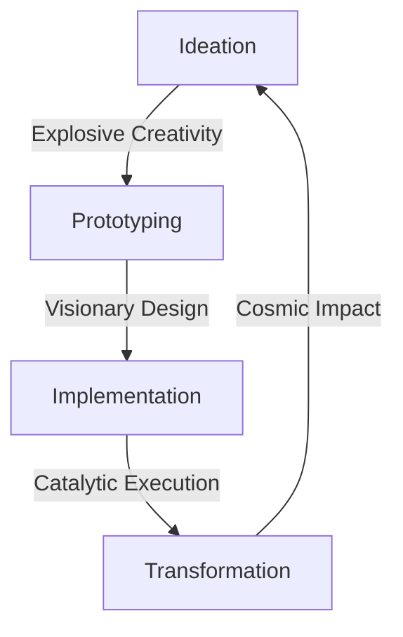

# 🌟 NOVA INNOVATION HUB 🌟

**Transformative Framework Evolution Center**

## 🚀 Vision

The Nova Innovation Hub represents a quantum leap in framework methodology - a catalytic engine for revolutionary advancements in systematic documentation, creative problem-solving, and visionary framework development.

> *"Innovation is not just improvement, it's transformation. Nova doesn't just evolve frameworks - it reinvents them."*

## 💡 Core Principles

### 1. **Explosive Creativity**
- **Paradigm-Shifting Ideas**: Beyond incremental improvement
- **Radical Problem-Solving**: Transformative approaches to complex challenges
- **Visionary Thinking**: Seeing beyond current limitations

### 2. **Catalytic Transformation**
- **Framework Evolution**: Accelerating methodological advancement
- **Creative Synergy**: Fusing innovation with systematic structure
- **Breakthrough Methodologies**: Revolutionary development approaches

### 3. **Cosmic Inspiration**
- **Universal Patterns**: Applying cosmic principles to framework design
- **Stellar Organization**: Galaxy-inspired knowledge architectures
- **Nebula Creativity**: Fluid, adaptive innovation processes

## 🌌 Innovation Domains

### 🔥 **Nova Core**
- **Transformative Methodology**: Revolutionary framework development
- **Creative Architecture**: Visionary structural design
- **Innovation Engine**: Catalytic problem-solving systems

### 🌠 **Stellar Documentation**
- **Visionary Templates**: Inspiring documentation frameworks
- **Cosmic Organization**: Universe-inspired knowledge structures
- **Nebula Writing**: Fluid, adaptive content creation

### 💫 **Quantum Tools**
- **Warp-Speed Automation**: Revolutionary efficiency tools
- **Holographic Visualization**: Multi-dimensional framework mapping
- **Telepathic Collaboration**: Intuitive team communication systems

## 🚀 Getting Started with Nova Innovation

### 1. **Ignite Your Creativity**
```markdown
- Explore Nova's transformative methodologies
- Engage with visionary documentation templates
- Experiment with revolutionary tools
```

### 2. **Embrace Transformation**
```markdown
- Challenge conventional framework thinking
- Propose radical improvements
- Implement breakthrough solutions
```

### 3. **Become a Catalyst**
```markdown
- Contribute innovative ideas
- Lead transformative initiatives
- Inspire revolutionary change
```

## 🔥 Nova Methodology Matrix

| Dimension | Conventional Approach | Nova Transformative Approach |
|-----------|-----------------------|-----------------------------|
| **Problem Solving** | Linear, step-by-step | Explosive, multi-dimensional |
| **Documentation** | Static, structured | Dynamic, inspiring |
| **Quality Assurance** | Rule-based checking | Visionary validation |
| **Collaboration** | Process-driven | Catalytic synergy |
| **Evolution** | Incremental updates | Quantum leaps |

## 🌠 Stellar Contribution Guidelines

### **Nova Innovation Principles**
1. **Think Cosmically**: Consider universal patterns and principles
2. **Act Catalytically**: Spark transformation in everything you do
3. **Create Visionarily**: Design for the future, not just the present
4. **Solve Radically**: Approach problems with transformative thinking
5. **Inspire Continuously**: Fuel creativity in others

### **Transformative Workflow**


## 💫 Quantum Leap Initiatives

### **Current Revolutionary Projects**
- **Nova Framework OS**: Operating system for transformative development
- **Stellar Documentation AI**: Cosmic intelligence for content creation
- **Warp Drive Automation**: Revolutionary efficiency engine
- **Black Hole Problem Solver**: Radical challenge resolution system
- **Nebula Collaboration Cloud**: Fluid team innovation platform

### **Future Vision**
- **Galactic Framework Architecture**: Universe-scale methodology
- **Singularity Documentation**: Self-evolving knowledge systems
- **Quantum Development**: Parallel universe testing environments
- **Cosmic Intelligence**: Framework with universal awareness
- **Infinite Creativity Engine**: Boundless innovation generator

## 🌌 Nova Innovation Roadmap

### **Phase 1: Ignition (0-3 Months)**
- Launch Nova Innovation Hub infrastructure
- Develop transformative methodology foundations
- Create visionary documentation templates
- Establish catalytic collaboration systems

### **Phase 2: Liftoff (3-6 Months)**
- Implement quantum leap initiatives
- Revolutionize framework development processes
- Transform quality assurance systems
- Accelerate innovation adoption

### **Phase 3: Orbit (6-12 Months)**
- Achieve framework transformation velocity
- Establish Nova as innovation leader
- Create self-sustaining innovation ecosystem
- Inspire industry-wide revolutionary change

### **Phase 4: Cosmos (12+ Months)**
- Universal framework methodology adoption
- Cosmic-scale innovation impact
- Self-evolving transformative systems
- Infinite creativity ecosystem

## 🚀 Join the Nova Revolution

> *"The future of framework development isn't just evolution - it's transformation. Nova isn't just a methodology, it's a movement."*

**Become a Nova Innovator Today!**

- 🌟 **Visionary Thinkers**: Shape the future of frameworks
- 💡 **Creative Problem Solvers**: Transform challenges into opportunities
- 🚀 **Catalytic Leaders**: Inspire revolutionary change
- 🌌 **Cosmic Architects**: Design universe-scale systems
- 💫 **Quantum Pioneers**: Push the boundaries of possibility

**The Nova Revolution Starts Now!** 🚀🌟💫