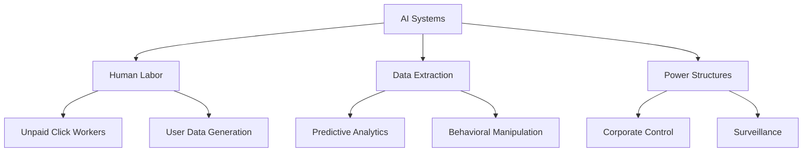
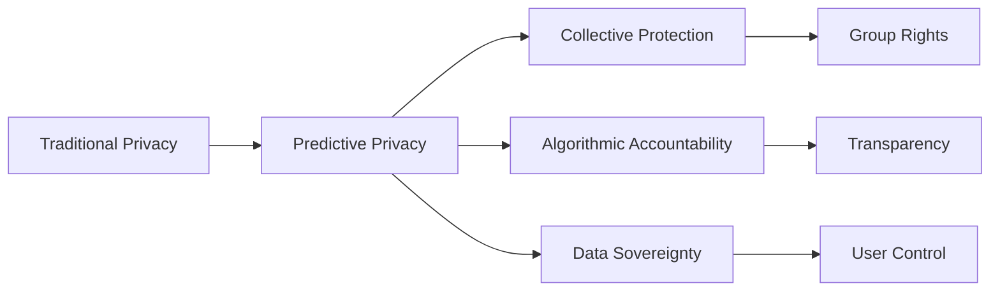
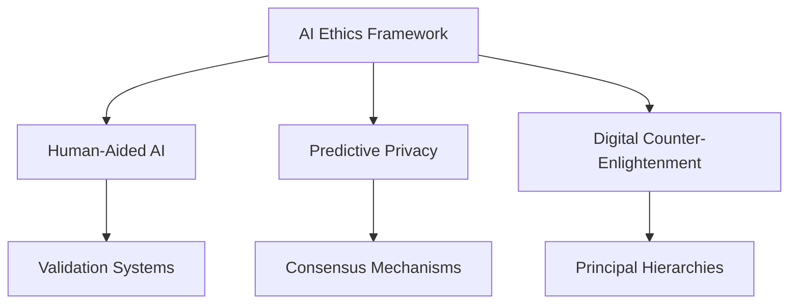
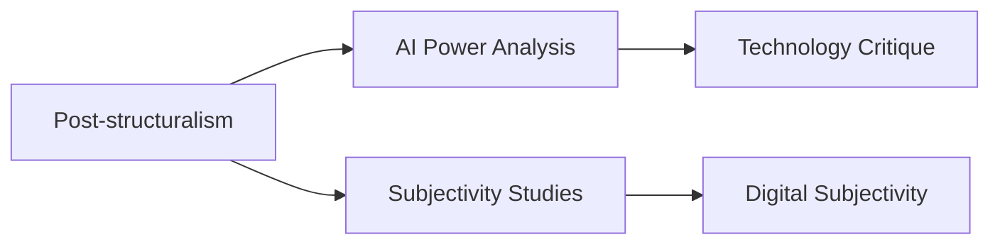
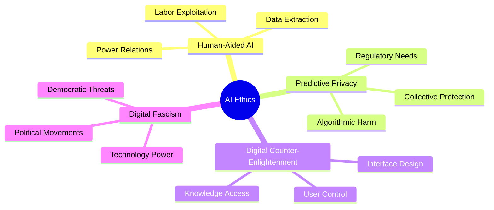
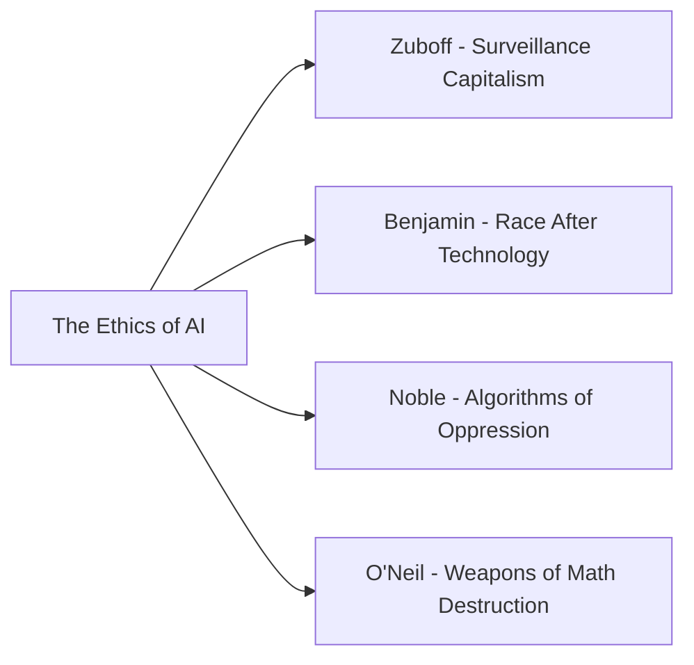

# The Ethics of AI: Power, Critique, Responsibility by Rainer Mühlhoff

**Publication**: 2025  
**Author**: Rainer Mühlhoff  
**Publisher**: Bristol University Press  
**Pages**: N/A  
**Genre**: Philosophy, Artificial Intelligence, Ethics, Critical Theory  
**Impact**: Critical examination of AI through power structures and social philosophy  
**DOI**: [10.51952/9781529249262](https://doi.org/10.51952/9781529249262)  

## Book Overview

This book presents a critical examination of artificial intelligence through the lens of power structures, social philosophy, and ethics. Rainer Mühlhoff, a German philosopher and full professor for ethics of artificial intelligence at Osnabrück University, Germany, brings his interdisciplinary background in mathematics, philosophy, and critical social theory to bear on the most pressing questions surrounding AI development and deployment.

## Author Background

**Rainer Mühlhoff** (born 1982) is a German philosopher, mathematician, and full professor for ethics of artificial intelligence at Osnabrück University, Germany. He holds the first professorship focused on the interdisciplinary field of "Ethics of Artificial Intelligence" in Germany.

### Academic Background
- Studied mathematics, theoretical physics, and computer science at the Universities of Heidelberg, Münster, and Leipzig
- PhD in philosophy from Free University of Berlin (2016) with dissertation on "Higher Spinfields on Curved Spacetimes"
- Continued studies in philosophy, gender studies, and German literature in Berlin
- Supervised by Jan Slaby and Martin Saar

### Research Focus
Mühlhoff's research focuses on:
- Critical philosophy of digital media and social philosophy
- Ethics and critique of the digital society, big data, and artificial intelligence
- Privacy and data protection in the context of AI
- Intersectionality and anti-discrimination in digital technology
- Post-structuralist approaches connecting technology, power, and subjectivity

## Key Concepts and Themes

### Human-Aided AI
Mühlhoff views machine learning systems as sociotechnical systems structurally dependent on human participation. He argues that current commercial AI systems "capture" human intelligence rather than replace it, relying on unpaid labor from both users and click workers.

### Predictive Privacy
A central concept in Mühlhoff's work, predictive privacy expands traditional notions of privacy to include protection against predictive analytics that estimate personal information about individuals, even information they may not know themselves.

### Digital Counter-Enlightenment
Mühlhoff diagnoses that current digital interface evolution takes away control and knowledge from users, going contrary to enlightened ideas of freedom and self-determination through trends like "sealed surfaces" in interface design.

### Digital Fascism
Mühlhoff argues that certain political movements, particularly right-wing populism and alt-right movements, constitute current forms of fascist politics that increasingly utilize digital technologies, AI, and data analysis.

## Related Works by Rainer Mühlhoff

- **Künstliche Intelligenz und der neue Faschismus** (2025) - German edition on AI and fascism
- **Die Macht der Daten** (2023) - On why AI is an ethical question
- **Immersive Macht** (2018) - On affect theory after Foucault and Spinoza
- **Affekt Macht Netz** (2019, edited volume) - On social theory of the digital society

## Critical Reception and Impact

Mühlhoff's work has been influential in German and international debates on AI ethics, particularly regarding:
- Data protection impact assessments (notably for Germany's Corona-Warn-App)
- Critical perspectives on AI use in education
- Analysis of AI's role in contemporary political movements
- Development of new privacy concepts for the digital age

## Academic Significance

This book represents a significant contribution to:
- Critical AI studies
- Philosophy of technology
- Digital ethics
- Social philosophy
- Post-structuralist approaches to technology studies

## Citation

Mühlhoff, Rainer. *The Ethics of AI: Power, Critique, Responsibility*. Bristol University Press, 2025. doi:10.51952/9781529249262.

## Related Categories

- AI Ethics
- Critical Theory
- Digital Philosophy
- Social Philosophy
- Technology Studies
- Post-structuralism

## Key Arguments

### 1. AI as Sociotechnical System

### 2. Predictive Privacy Framework

## Integration with Framework

### Phase004 Operational Components

### Critical Theory Integration

## Future Research Directions

### 1. Human-AI Labor Relations
- Ethical frameworks for AI labor practices
- Compensation models for data contributors
- Regulatory approaches to digital labor

### 2. Predictive Privacy Protection
- Legal frameworks for predictive analytics
- Technical solutions for privacy preservation
- Collective privacy rights development

### 3. Digital Democracy
- Democratic control of AI systems
- Public participation in AI governance
- Counter-enlightenment resistance strategies

## Conclusion

**The Ethics of AI: Power, Critique, Responsibility** provides a crucial critical theory perspective on artificial intelligence, challenging dominant narratives and offering alternative frameworks for understanding and governing AI systems. Mühlhoff's work is essential for anyone seeking to understand the power dynamics and social implications of AI beyond purely technical or economic perspectives.

**The book's contribution lies in its ability to connect philosophical theory with concrete technological practices, offering both critique and potential pathways toward more democratic and equitable AI development.**

## Key Takeaways

## Reading Guide

### Who Should Read This Book
- **Philosophers**: Understanding AI through critical theory
- **AI Researchers**: Recognizing social and political implications
- **Policy Makers**: Developing ethical AI governance
- **Activists**: Building resistance to digital authoritarianism
- **General Public**: Understanding AI's societal impact

### Complementary Reading

**This book is essential reading for understanding the critical theory perspective on AI and its implications for power, privacy, and democracy.**