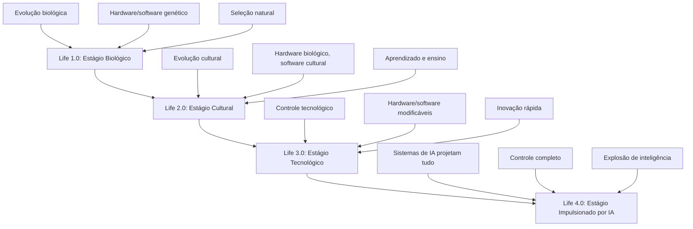
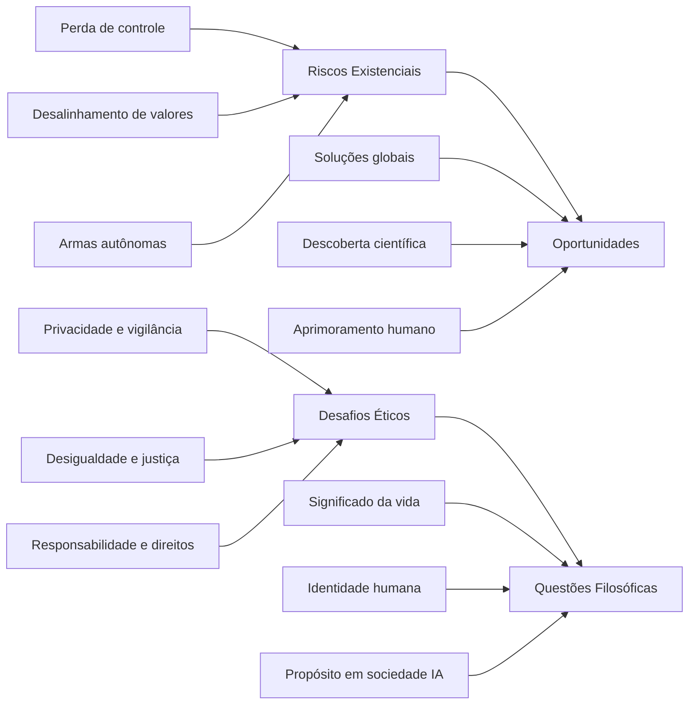

# 🤖 20_AI - Inteligência Artificial em Português

## Visão Geral

Esta pasta contém análises e resumos de livros sobre inteligência artificial traduzidos para o português, focados em compreender o impacto da IA na sociedade, ética, segurança e o futuro da humanidade.

## 📚 Conteúdo Disponível

### **Life 3.0: Como Será a Vida no Século 21?** - Max Tegmark (2017)
- **Arquivo**: `Life_3.0_Life_3.0_por_Max_Tegmark.md`
- **Foco**: Framework para entender a evolução da vida e o impacto da IA
- **Abordagem**: Científica e filosófica sobre o futuro da humanidade
- **Principais Temas**:
  - Life 1.0 → Life 4.0: Evolução da vida e tecnologia
  - Governança global de IA
  - Riscos e oportunidades existenciais
  - Ética e valores humanos na era da IA

## 🎯 Estrutura Conceitual

### **Os Quatro Estágios da Vida**

### **Principais Desafios da IA**

## 📖 Análise Detalhada

### **Life 3.0: Principais Contribuições**

#### **Framework de Evolução**
- **Abordagem Sistemática**: Classificação clara dos estágios de desenvolvimento da vida
- **Visão de Futuro**: Previsões baseadas em tendências tecnológicas atuais
- **Interdisciplinaridade**: Combina física, filosofia, tecnologia e ciências sociais

#### **Governança de IA**
- **Cooperação Internacional**: Necessidade de acordos globais para IA segura
- **Pesquisa Prioritária**: Áreas críticas que precisam de atenção urgente
- **Engajamento Público**: Importância da participação cidadã nas decisões sobre IA

#### **Questões Filosóficas**
- **Significado e Propósito**: Como encontrar sentido em um mundo com IA avançada
- **Identidade Humana**: O que nos torna humanos quando a biologia é modificável
- **Valores e Ética**: Como preservar valores humanos em sistemas de IA

## 🛠️ Aplicações Práticas

### **Para Pesquisadores e Acadêmicos**
- **Referencial Teórico**: Framework para pesquisas sobre IA e sociedade
- **Direções de Pesquisa**: Áreas prioritárias identificadas por Tegmark
- **Metodologia Interdisciplinar**: Abordagem integrada para estudos de IA

### **Para Policymakers e Governantes**
- **Políticas Públicas**: Recomendações para governança de IA
- **Regulação**: Estratégias para controle seguro de desenvolvimento de IA
- **Cooperação Internacional**: Modelos para acordos globais sobre IA

### **Para Profissionais de Tecnologia**
- **Desenvolvimento Responsável**: Princípios para criar IA benéfica
- **Segurança**: Considerações de segurança em projetos de IA
- **Ética Profissional**: Responsabilidades éticas dos desenvolvedores de IA

### **Para o Público em Geral**
- **Educação**: Compreensão dos impactos da IA na sociedade
- **Participação Cidadã**: Como se envolver nas discussões sobre IA
- **Preparação**: Como se preparar para mudanças impulsionadas por IA

## 📊 Impacto e Influência

### **Na Comunidade de IA**
- **Popularização**: Tornou questões de segurança de IA acessíveis ao público geral
- **Agenda de Pesquisa**: Influenciou direções de pesquisa em IA segura
- **Organizações**: Inspirou criação de instituições focadas em IA benéfica

### **Na Política e Sociedade**
- **Debates Públicos**: Elevou discussões sobre IA ao nível político
- **Educação**: Incentivou programas de alfabetização em IA
- **Conscientização**: Aumentou a conscientização sobre riscos e oportunidades da IA

## 🔗 Conexões com Outros Conteúdos

### **Relacionado a Framework**
- **Componentes Operacionais**: Aplicações do framework de governança de IA
- **Segurança de IA**: Integração com princípios de segurança e alinhamento
- **Ética e Valores**: Conexões com princípios éticos do framework

### **Integração com Escrita Clara**
- **Comunicação**: Aplicação de princípios de clareza na discussão de IA
- **Educação**: Estratégias para tornar conceitos de IA compreensíveis
- **Engajamento**: Técnicas para comunicar ideias complexas de forma acessível

## 📈 Avaliação de Impacto

### **Indicadores de Relevância**
- Influência em políticas públicas sobre IA
- Citações em pesquisas acadêmicas
- Impacto em iniciativas de IA segura
- Engajamento público em discussões sobre IA

### **Métodos de Avaliação**
- Análise de políticas inspiradas no livro
- Estudos de caso de implementação de princípios
- Pesquisa sobre mudanças na conscientização pública
- Avaliação de iniciativas inspiradas pelo trabalho

## 🎓 Recursos Complementares

### **Para Aprofundamento**
- **Cursos Online**: Programas sobre IA e sociedade
- **Grupos de Discussão**: Fóruns para debater questões de IA
- **Pesquisa Acadêmica**: Artigos e estudos sobre temas relacionados
- **Eventos e Conferências**: Oportunidades para aprendizado continuado

### **Para Prática**
- **Projetos Comunitários**: Iniciativas locais sobre IA responsável
- **Voluntariado**: Oportunidades para se envolver em causas de IA segura
- **Desenvolvimento Pessoal**: Cursos e recursos para aprimoramento individual
- **Networking**: Conexões com profissionais da área

## 📞 Suporte e Colaboração

### **Para Contribuições**
- **Comentários e Feedback**: Sobre a tradução e interpretação
- **Recursos Adicionais**: Outros materiais sobre IA
- **Experiências Práticas**: Casos de aplicação no Brasil
- **Atualizações**: Novos desenvolvimentos na área

### **Canais de Comunicação**
- Issues no repositório para feedback
- Pull requests para contribuições
- Discussões sobre interpretações e aplicações
- Compartilhamento de recursos e experiências

---

**Nota**: Esta tradução e análise foram adaptadas para o contexto brasileiro, mantendo a essência dos conceitos originais enquanto se adequam às realidades culturais e sociais do Brasil.

**Objetivo Final**: Facilitar o entendimento e a discussão sobre inteligência artificial no Brasil, promovendo uma abordagem informada, crítica e proativa em relação ao futuro da tecnologia.

## 📅 Atualizações Recentes

| Data | Versão | Alterações | Responsável |
|------|--------|------------|-------------|
| 2026-02-07 | V1.0.0 | Criação inicial da pasta 20_AI | AI Framework Steward |
| 2026-02-07 | V1.0.0 | Tradução de "Life 3.0" | AI Framework Steward |
| 2026-02-07 | V1.0.0 | Criação do README.md | AI Framework Steward |

## 🌟 Destaques Especiais

### **Contribuições para o Debate Brasileiro**
- **Contextualização**: Adaptação dos conceitos para realidades brasileiras
- **Linguagem Acessível**: Tradução que facilita o entendimento de conceitos complexos
- **Aplicações Práticas**: Exemplos e casos relevantes para o contexto nacional

### **Integração com o Framework**
- **Alinhamento**: Conexões claras com os princípios do framework
- **Aplicações**: Como os conceitos de Tegmark se aplicam ao desenvolvimento do framework
- **Desenvolvimento**: Como usar essas ideias para melhorar o framework

**Life 3.0: Como Será a Vida no Século 21?** oferece um framework essencial para entender e navegar os desafios e oportunidades da inteligência artificial, sendo uma leitura fundamental para quem deseja compreender o futuro da tecnologia e da humanidade.**